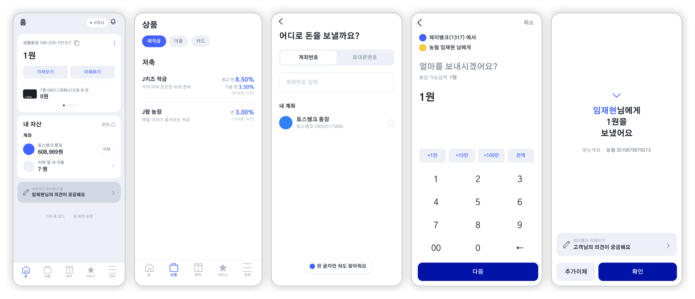
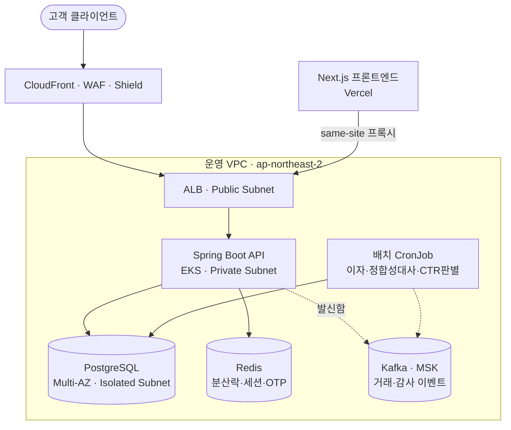
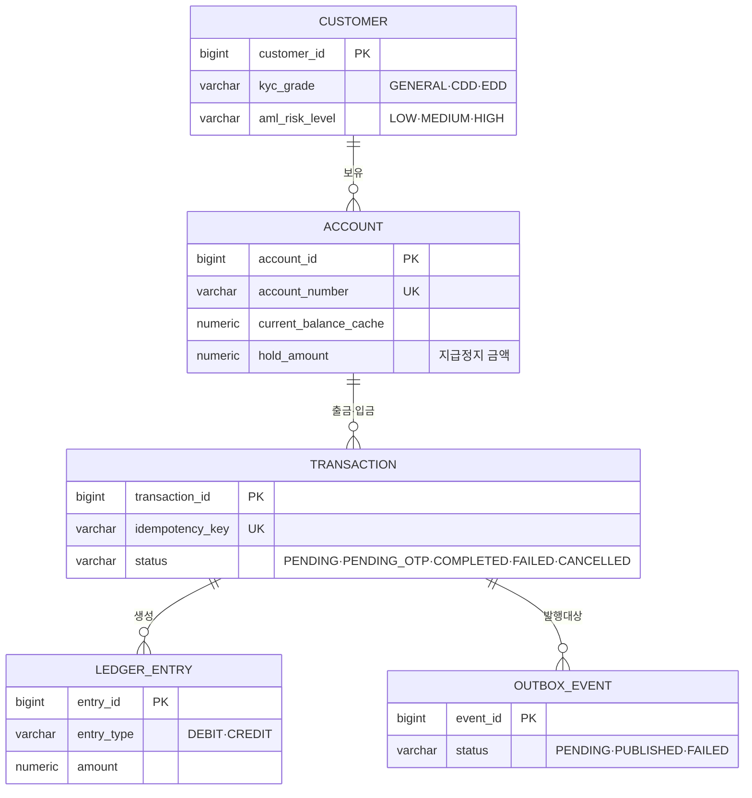
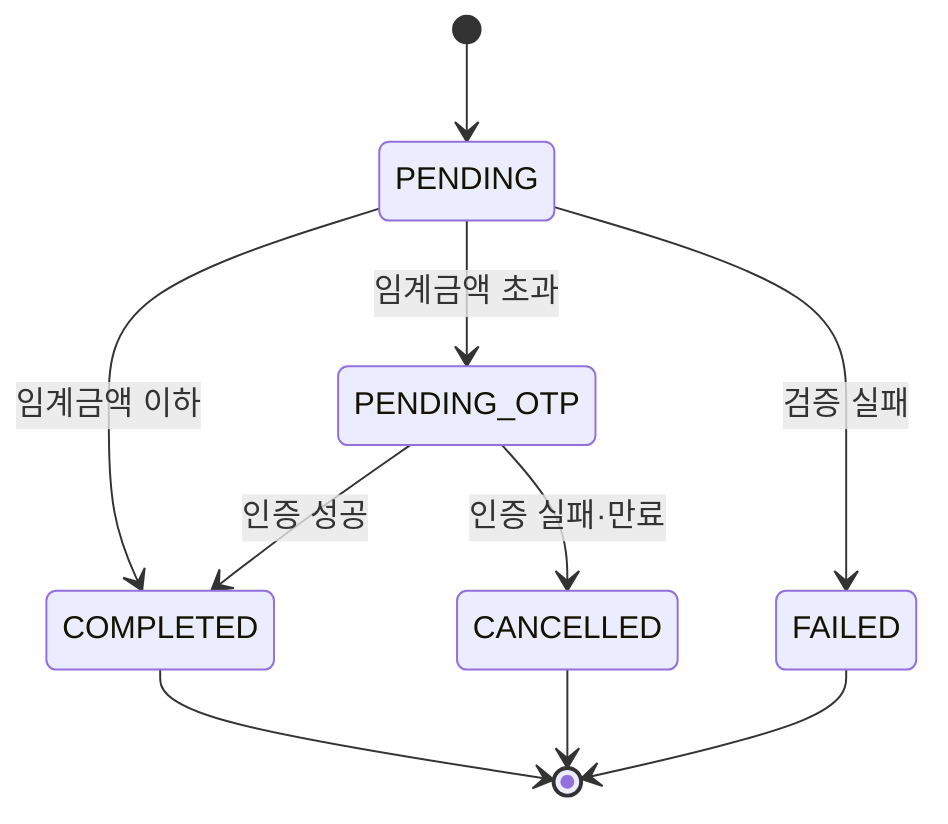

# J-Bank

**계좌 원장과 이체를 코어로 하는 폐쇄형 코어뱅킹 시스템입니다.** 트랜잭션 정합성, 동시성 제어, 멱등성, 이벤트 기반 아키텍처, 금융 규제 준수를 개인 프로젝트 규모에서 실제 은행 시스템과 같은 원칙으로 구현하는 것을 목표로 합니다. 설계 문서 11종을 먼저 작성해 요구사항·ERD·API·인프라 사이의 정합성을 맞춘 뒤 구현에 착수했습니다.


## 화면



Figma에서 디자인 토큰부터 41개 화면, 81개 프로토타입 배선까지 직접 구성했습니다. [Figma 파일](https://www.figma.com/design/rB8P0k4VRswqKrCjlE4c9s/Bank) · [디자인 노트](docs/08_J-Bank_앱디자인노트.md)

## 핵심 기능

| 영역 | 기능 | Phase |
|---|---|---|
| 계좌 관리 | 고객 등록 및 CDD/EDD, 계좌 개설·조회·상태관리·해지 | 1~2 |
| 거래·원장 | 입출금, 계좌이체(복식부기), 잔액/거래내역 조회, 원장 정합성 검증 배치 | 1~2 |
| 인증·보안 | 로그인/토큰 재발급(httpOnly 쿠키), 권한 검증, 고액이체 2차 인증(OTP) | 1~2 |
| 상품 | 예적금 가입, 이자 계산 배치, 만기 처리 | 2~3 |
| 지원 기능 | 감사 로그, 이체 완료 알림(Kafka), 이상거래 탐지, CTR 판별 | 2~3 |

전체 22개 기능 요구사항은 [요구사항명세서](docs/01_J-Bank_요구사항명세서.md)에 있으며, 현재 구현 상태는 [진행 상황](#진행-상황)에서 확인하실 수 있습니다.

## 규제 대응

실제 금융권 인가 사업자만 접속할 수 있는 구간만 목업으로 대체하고, 그 외 절차와 데이터 구조는 실제 규정대로 설계했습니다.

| 항목 | 접근이 막히는 이유 | 이 프로젝트의 대안 |
|---|---|---|
| 실명확인 | 행정안전부 공적장부 조회는 감독당국 승인 및 기관 간 계약을 거친 금융회사만 가능 | 인터페이스로 분리, 개발 환경에서는 형식 검증 + 더미 DB 대조 목업 |
| 고액현금거래보고(CTR) | 금융정보분석원(KoFIU) 전산망은 승인받은 금융기관만 접속 가능 | 1거래일 1천만원 이상 판별과 내부 큐 적재까지 구현, 전송은 로그로 대체 |
| 공동인증서/전자서명 | 전자서명인증사업자 인정은 기업 단위 심사 절차라 개인 개발자 단위로는 사실상 불가능 | OTP 기반 2차 인증을 실무적 대체 수단으로 채택 |

근거는 [요구사항명세서 7.1절](docs/01_J-Bank_요구사항명세서.md), [인프라아키텍처 13절](docs/06_J-Bank_인프라아키텍처.md)에 있습니다.

## 시스템 아키텍처



프론트엔드(Vercel)와 백엔드(AWS)를 분리 배포하되, 원장·개인정보를 다루는 컴포넌트는 전부 AWS 안에 둡니다. 계정 구조, 망분리, 키 관리까지 포함한 전체 설계는 [인프라아키텍처 문서](docs/06_J-Bank_인프라아키텍처.md)에서 확인하실 수 있습니다.

## 기술 스택

| 영역 | 스택 |
|---|---|
| 백엔드 | Java 21, Spring Boot 3.5, Spring Data JPA, Spring Security, Spring Batch, Spring Kafka, Flyway, Redisson(분산락), springdoc-openapi |
| 데이터 | PostgreSQL 16, Redis 7, Kafka(MSK) |
| 백엔드 테스트 | JUnit5, ArchUnit(의존 방향 강제), Testcontainers, Spotless(Google Java Format) |
| 프론트엔드 | React 18, Next.js 14(App Router), TypeScript, TanStack Query, Zustand, React Hook Form + Zod, Tailwind v4 + shadcn/ui, Axios, openapi-typescript |
| 프론트엔드 테스트 | Jest, React Testing Library, Playwright(E2E) |
| 인프라 | AWS EKS/RDS/ElastiCache/MSK/WAF, Terraform, GitHub Actions, ArgoCD(GitOps), Vercel |

## 프로젝트 구조

```
apps/jbank-api/   Spring Boot 단일 모듈, 도메인 패키지 경계 + ArchUnit
apps/frontend/    Next.js 14 App Router
infra/            Docker Compose, Dockerfile, Terraform, Helm
contracts/        OpenAPI 스냅샷, 수동 호출 컬렉션
perf/             k6 스크립트와 주차별 결과
docs/             설계 문서, ADR, 런북
```

단일 모듈에서 도메인 패키지(`account`, `customer`, `ledger`, `transfer`, `product` 등)로 나누고 ArchUnit으로 의존 방향을 강제합니다. 경계가 실제로 지켜졌음이 확인되는 Phase 3에 한 도메인만 분리할 계획이며, 처음부터 MSA로 시작하지 않습니다. 근거는 [폴더구조 문서](docs/10_J-Bank_폴더구조.md)에 있습니다.

## ERD



전체 10개 엔티티, 컬럼 제약, 인덱스 설계는 [ERD 문서](docs/02_J-Bank_ERD.md)에 정리되어 있습니다.

## Ledger 설계

`LEDGER_ENTRY`는 append-only 테이블이며 확정된 금전 이동만 기록합니다. `UPDATE`·`DELETE`는 애플리케이션 레벨에서 차단합니다(리포지토리 미노출 + JPA 리스너 이중 방어).

2차 인증 대기 중인 이체 금액은 원장에 손대지 않고 계좌의 `hold_amount`(지급정지 금액)로만 관리합니다. 출금 가능 금액은 별도 컬럼 없이 항상 파생 계산합니다.

```
출금 가능 금액 = current_balance_cache − hold_amount
```

이렇게 분리한 이유는, 대기 금액을 잔액에서 빼지 않으면 같은 잔액으로 여러 건의 대기 거래가 만들어져 초과 출금이 발생하고, 반대로 잔액을 실제로 차감하면 원장에 기록되지 않은 금액이 잔액에서 사라져 원장 합산과 어긋나기 때문입니다. 취소된 거래는 원장에 흔적을 남기지 않으므로 정합성 검증이 깨지지 않습니다.

거래 상태는 다섯 단계로 관리하며, 종료 상태(`COMPLETED`/`FAILED`/`CANCELLED`)에서는 어떤 전이도 허용하지 않습니다.



커밋과 이벤트 발행 사이의 원자성은 발신함(Outbox)으로 확보합니다. 이벤트를 원본 거래와 같은 DB 트랜잭션에 먼저 적재하고, 별도 발행기가 미발행 레코드를 폴링해 Kafka로 발행합니다. 최소 한 번 전달을 보장하고, 중복은 소비자 측 멱등 처리로 흡수합니다.

## 동시성·멱등성 처리

- **락 순서 고정.** 이체 시 두 계좌번호를 오름차순 정렬한 뒤 순서대로 비관적 락을 획득해 교착상태를 원천 차단합니다.
- **Idempotency-Key.** 클라이언트가 제공한 키에 DB 유니크 제약을 걸어, 애플리케이션 레벨 중복 확인과 이중으로 방어합니다. 동일 키로 동시에 들어온 두 번째 요청은 유니크 제약 위반으로 막힙니다.
- **분산락.** OTP·세션처럼 여러 인스턴스가 공유하는 휘발성 상태는 Redisson 기반 분산락과 Redis TTL로 관리합니다(W5).
- **검증 계획.** 동시성 시나리오 5종(동시 출금, 동시 이체, 락 순서 역전 등)을 Testcontainers 기반 통합 테스트로 검증하는 것이 W2 목표입니다.

## 테스트 전략

계층별로 목표를 다르게 둡니다.

| 계층 | 대상 | 도구 |
|---|---|---|
| 단위 테스트 | 도메인 계산 로직(체크디지트, CDD 등급, 이자 계산, 출금 가능 금액) | JUnit5 |
| 구조 테스트 | 도메인 패키지 의존 방향 강제, 위반 시 병합 차단 | ArchUnit |
| 통합 테스트 | 실제 DB·캐시 기반 서비스 계층, 동시성·멱등성 시나리오 | Testcontainers |
| API 테스트 | 공통 응답 포맷·에러코드 계약 검증 | MockMvc |
| E2E 테스트 | 실제 브라우저 흐름 | Playwright |

커버리지 수치를 일괄 목표로 삼지 않고, 원장·이체·인증 세 패키지에만 분기 커버리지 80%를 기준선으로 두어 파이프라인에서 강제합니다. 현재는 체크디지트 검증기와 CDD/KYC 등급 산정 로직에 단위 테스트가 있으며, 통합·동시성 테스트는 W2에 추가할 예정입니다. 상세 방침은 [구현계획 10절](docs/07_J-Bank_구현계획.md)에 있습니다.

## 실행 방법

```bash
scripts/bootstrap.sh      # 도구 확인 + 의존성 설치 + 로컬 인프라 기동
scripts/dev.sh core       # PostgreSQL 16 + Redis 7

cd apps/jbank-api && ./gradlew bootRun --args='--spring.profiles.active=local'
# http://localhost:8080/swagger-ui.html

cd apps/frontend && npm run dev
# http://localhost:3000
```

전체 세팅 절차는 [`docs/README.md` 로컬 개발 환경](docs/README.md#로컬-개발-환경)에 있습니다.

## 트러블슈팅

| 문제 | 원인 | 해결 |
|---|---|---|
| Spring Initializr가 문서상 확정 버전(3.3)을 거부 | Spring Boot 3.3이 OSS 지원 종료로 Initializr 목록에서 제외됨 | Maven Central에서 3.x 최신 패치(3.5.16) 직접 확인, Initializr 없이 Gradle 파일 수동 작성 |
| ArchUnit 규칙이 전부 실패 | 도메인 클래스가 아직 없어 검증 대상이 0개(`failOnEmptyShould` 기본값) | 도메인 코드가 쌓이기 전까지 해당 옵션 비활성화, 코드가 생기면 원복 |
| Tailwind v3→v4 전환 중 shadcn/ui·폰트 연쇄 붕괴 | 스캐폴딩 도구가 이전 도구의 산출물을 완전히 인식하지 못함 | 단계마다 빌드로 검증하며 postcss 설정·폰트를 순서대로 교체 |
| 금액 필드가 과학적 표기(`1E+2`)로 직렬화될 위험 | `BigDecimal.toString()`은 스케일에 따라 지수 표기를 낼 수 있음 | `toPlainString()` 기반 커스텀 Jackson 시리얼라이저 구현 |
| Swagger UI가 로그인 페이지로 리다이렉트 | `spring-security` 의존성만 있고 `SecurityConfig`가 없어 전체 인증 요구 기본정책이 적용됨 | 임시 `SecurityConfig`로 `/v3/api-docs`, `/swagger-ui`만 `permitAll` |

세부 과정은 [`docs/devlog/`](docs/devlog/)에 있습니다.

## 향후 개선 계획

| 주차 | 목표 |
|---|---|
| W2 | 원장·거래 코어 구현, 동시성·멱등성 시나리오 검증, 성능 베이스라인 기록 |
| W3 | 인증·보안, 상품 도메인 구현, Phase 1 마감(`v0.1.0`) |
| W4~W5 | 감사 로그·위험도 이력, 발신함 기반 이벤트 알림, 배치 처리, 고액이체 2차 인증(Phase 2) |
| W6~W7 | 관측 가능성·성능 최적화·Terraform 코드화, 쿠버네티스 배포·GitOps·서비스 분리(Phase 3, `v1.0.0`) |

전체 로드맵과 완료 기준은 [구현계획 문서](docs/07_J-Bank_구현계획.md)에 있습니다.

## 진행 상황

Phase 1(코어 도메인 확립) 1주차가 진행 중입니다. 공통 응답 포맷, 전역 예외 처리, 요청추적ID, 금액 직렬화, Springdoc 노출 등 공통 기반을 마쳤고, 계좌번호 체크디지트 검증기와 CDD/KYC 등급 산정 로직을 단위테스트와 함께 구현했습니다. 계좌·거래 도메인 엔티티와 API는 진행 중입니다.

주차별 체크리스트는 [`todo/W1.md`](todo/W1.md), 작업 과정은 [`docs/devlog/`](docs/devlog/)에서 확인하실 수 있습니다.

## 문서

설계 문서 11종이 [`docs/README.md`](docs/README.md)에 정리되어 있습니다. 처음 보시는 경우 다음 순서를 권합니다.

1. [요구사항명세서](docs/01_J-Bank_요구사항명세서.md) — 기능 요구사항 22개, 규제 목업 처리 근거
2. [ERD](docs/02_J-Bank_ERD.md) — 지급정지 금액, 발신함 등 설계 판단이 드러나는 데이터 구조
3. [API설계](docs/03_J-Bank_API설계.md) — 인증 쿠키, Idempotency-Key, 위조 방지 토큰 등 공통 규칙
4. [인프라아키텍처](docs/06_J-Bank_인프라아키텍처.md) — AWS 구성과 실제 금융권 관례 대비 축소 적용 근거
5. [폴더구조](docs/10_J-Bank_폴더구조.md) — 단일 모듈·도메인 패키지 경계를 택한 근거
