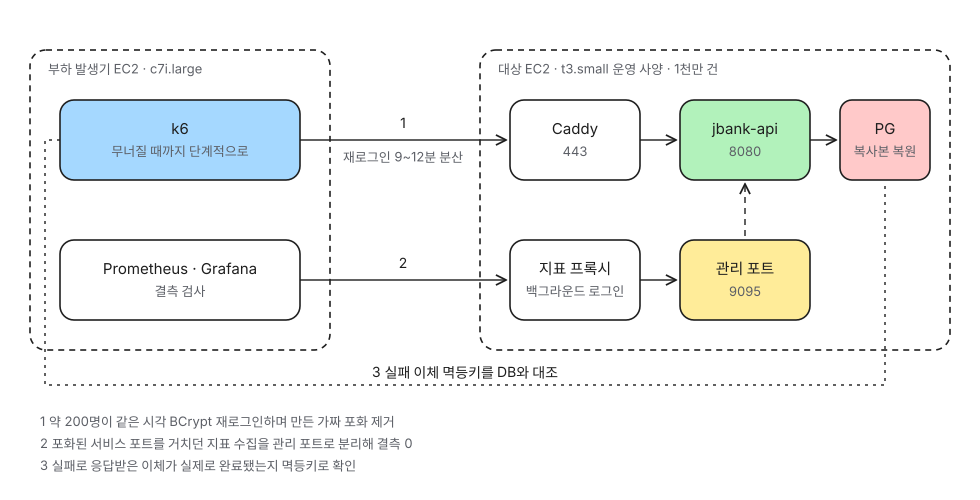

# J-Bank

계좌 원장과 이체를 코어로 하는 코어뱅킹 포트폴리오. 원장 정합성, 동시성, 멱등성을 실제 은행 시스템 원칙대로 구현하고 운영 사양에서 부하로 검증함


[www.j-bank.site](https://www.j-bank.site) · 데모 서버는 평일 09:00~18:00(KST)에만 운영


## 아키텍처


- 프론트는 Vercel, 원장·개인정보를 다루는 백엔드는 EC2 한 대 위 Docker Compose
- 외부 진입은 Caddy 80/443만. SSH 없이 배포·운영 접근 모두 SSM

## 주요 문제 해결

### 1. OTP 대기 이체의 초과 출금을 막기 위해 지급정지 금액(hold)을 분리해 잔액·원장 정합성 문제 해결


- 문제 원인
  - 고액 이체는 OTP 인증 전까지 `PENDING_OTP`로 대기
  - 대기 금액을 잔액에서 안 빼면 같은 잔액으로 대기 이체를 여러 건 만들 수 있어 초과 출금
  - 잔액에서 실제로 빼면 원장에 없는 금액이 잔액에서 사라져 원장 합과 잔액이 어긋남
- 해결 과정
  - 계좌에 `hold_amount`를 두고 출금 가능 금액은 `잔액 − hold`로 파생 계산(별도 컬럼 없음)
  - 원장은 확정된 이동(`COMPLETED`)만 기록. 리포지토리에 수정·삭제를 노출하지 않고 JPA 리스너로 한 번 더 막아 append-only 보장
  - OTP 성공 시 hold 해제 + 원장 기록, 실패 한도 초과·만료 시 `CANCELLED` + hold 해제
  - 테스트: Testcontainers(PostgreSQL) 통합 테스트로 인증 성공·실패 한도·만료·취소·출금 가능 금액 초과 거절 확인
- 결과
  - 대기 중 추가 출금은 출금 가능 금액 기준으로 거절돼 초과 출금 차단
  - 취소된 거래가 원장에 흔적을 남기지 않아 정합성 대사가 깨지지 않음
  - 1천만 건 규모 EC2 부하 테스트 전 회차에서도 차변 = 대변, 새 불일치 계좌 0 유지

### 2. 동시 이체의 교착과 중복 처리를 막기 위해 락 순서 고정과 멱등키 유니크 제약으로 동시성 문제 해결


- 문제 원인
  - A→B, B→A 이체가 동시에 오면 서로 상대 계좌 락을 기다리며 교착
  - 네트워크 재시도나 중복 클릭으로 같은 이체가 두 번 처리될 수 있음
  - 앱에서 키를 조회한 뒤 저장하는 방식은 동시 요청 두 개가 모두 조회를 통과
- 해결 과정
  - 두 계좌번호를 정렬해 항상 같은 순서로 비관적 락(`PESSIMISTIC_WRITE`)
  - 프론트가 제출 시점에 `Idempotency-Key`를 만들고 재시도에는 같은 키 사용. 서버는 앱 조회에 더해 DB 유니크 제약으로 한 번 더 막고, 같은 키면 기존 결과 반환
  - 테스트: 동시성 시나리오 5종을 Testcontainers(PostgreSQL)에서 실제 스레드로 동시 실행
- 결과
  - 잔액 10건분에 동시 출금 100건: 성공 10, 잔액 부족 90, 최종 잔액 0
  - 양방향 이체 50건씩 교착 없이 완료, 두 계좌 총액 보존
  - 같은 키 동시 요청 10건에 거래 1건, 20개 계좌 무작위 이체 1,000건 후 원장 합 = 잔액

### 3. 운영 사양의 한계를 찾기 위해 별도 EC2 부하 환경을 만들고 측정 결함을 바로잡아 병목과 금융 위험 발견



- 문제 원인
  - 로컬 k6로는 목표(p95 200ms, 초당 100건) 대비 16~20배 여유라 한계도 병목도 알 수 없었음
  - 운영과 같은 t3.small에서 처음 잰 결과를 검토하니 측정 자체에 결함 3개
    - 포화된 서비스 포트를 거쳐 지표를 수집해 가장 중요한 구간의 지표가 비어 있음
    - 가상 사용자 약 200명이 같은 시각에 BCrypt 재로그인해 서버 병목이 아닌 가짜 포화 발생
    - 실패 응답 수에 테스트 중단 순간의 요청이 섞여 부풀려짐
- 해결 과정
  - 대상과 부하 발생기를 분리한 EC2 두 대를 Terraform으로 측정할 때만 생성, 1천만 건 시드와 회차마다 PG 복사본 복원
  - 지표는 관리 포트(9095)로 분리하고 수집 대상별 결측 검사 추가, 재로그인은 9~12분에 분산
  - 실패 응답을 받은 이체의 멱등키를 모두 기록해 DB와 대조
  - 1차 결과를 버리고 시나리오 4종을 각 3회 재측정, 모든 회차 지표 결측 0
- 결과
  - 한 계좌로 이체가 몰리면 초당 80건에서 무너짐. CPU는 46%로 여유, 행 락 대기(0.77s)가 커넥션 풀을 고갈시켜 무관한 잔액 조회 p95가 8ms → 1,397ms
  - 클라이언트가 타임아웃(실패)을 받은 이체가 멱등키 대조 결과 사실상 전부 실제로 완료. 재시도 대신 새로 이체하면 중복 송금이 되는 위험
  - 이 기준선으로 입금을 수신 계좌별 묶음 반영으로 바꾼 뒤([ADR 0012](docs/adr/0012-async-credit.md)) 같은 조건으로 재측정: 초당 100건에서 이체 p95 395ms → 28ms, 무관한 조회 p95 307ms → 13ms, 커넥션 대기 0. 병목은 락에서 CPU로 이동([결과](perf/results/ec2-async-credit/summary.md))

### 4. 운영 비용 절감을 위해 EC2를 평일에만 켜고, 꺼진 시간의 배포·배치 누락 문제 해결


- 문제 원인
  - EKS·RDS 구성(월 약 $200)을 EC2 한 대로 낮춘 뒤에도 상시 가동 비용이 월 약 $24
  - 비용 때문에 인스턴스를 수동으로 끄자 main 머지마다 CD가 `InvalidInstanceId`로 실패
  - 새벽 cron 배치(이자·CTR·FDS·대사)는 서버가 꺼진 시간이라 한 번도 실행되지 않음
- 해결 과정
  - EventBridge Scheduler로 평일 09시 시작, 매일 18시 중지
  - CD가 인스턴스 상태를 확인해 꺼져 있으면 배포 스킵. 이미지에 revision 라벨을 붙여 켜질 때 부팅 작업(systemd)이 최신 이미지 반영
  - 새벽 cron 대신 부팅 직후 배치 실행. CTR·FDS는 Spring Batch 실행 기록에서 마지막 완료일을 찾아 빠진 날짜를 하루씩 처리
  - CD와 부팅 작업이 같은 flock 잠금으로 순차 배포. 서버가 꺼져 있으면 프론트에 운영 시간 안내
  - 테스트: 가짜 docker·aws로 부팅·배포 스크립트를 동시 배포 경합까지 검증, 1회용 스케줄로 실제 중지·시작 확인, 실제 DB에서 중단된 배치 기록이 재실행을 막는 문제를 재현하고 정리 로직 확인
- 결과
  - 월 약 $24 → $11, 꺼진 시간 CD 실패 없이 다음 부팅 때 자동 반영
  - 배치가 부팅 때 자동 실행되고 주말분도 누락 없이 처리
  - 결정 과정은 [ADR 0010](docs/adr/0010-ec2-single-instance.md), [ADR 0011](docs/adr/0011-ec2-weekday-hours.md)

## 기술 스택

| 영역 | 스택 |
|---|---|
| 백엔드 | Java 21, Spring Boot 3.5, JPA, Spring Security, Spring Batch, Flyway, Redisson |
| 프론트 | Next.js 14, TypeScript, TanStack Query, Zustand, Tailwind v4, shadcn/ui |
| 테스트 | JUnit5, ArchUnit, Testcontainers, Jest, Playwright, k6 |
| 인프라 | EC2, Docker Compose, Caddy, Terraform, GitHub Actions, Prometheus/Grafana, Vercel |

## 실행

```bash
scripts/up.sh    # Docker(PostgreSQL·Redis·관측) + 백엔드 + 프론트 한 번에
```

API http://localhost:8080/swagger-ui.html · 화면 http://localhost:3000 · 자세한 절차는 [docs/README.md](docs/README.md#로컬-개발-환경)

## 문서

- [설계 문서 11종](docs/README.md): 요구사항, ERD, API, 인프라 등
- [ADR](docs/adr/) · [개발일지](docs/devlog/) · [성능 측정](perf/README.md)
- [알려진 한계와 개선 과제](docs/11_J-Bank_알려진한계와개선과제.md)
