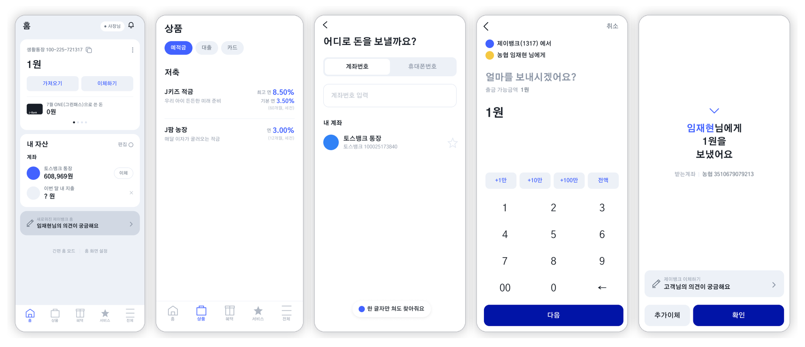
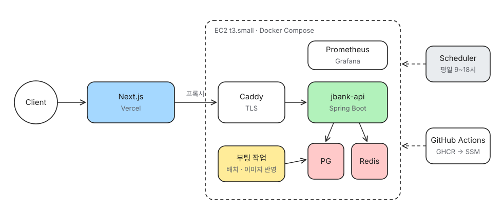
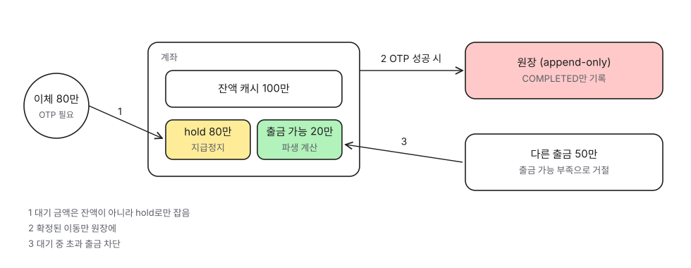
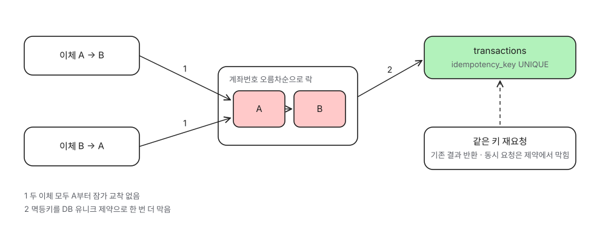
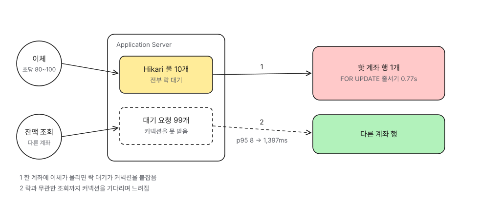
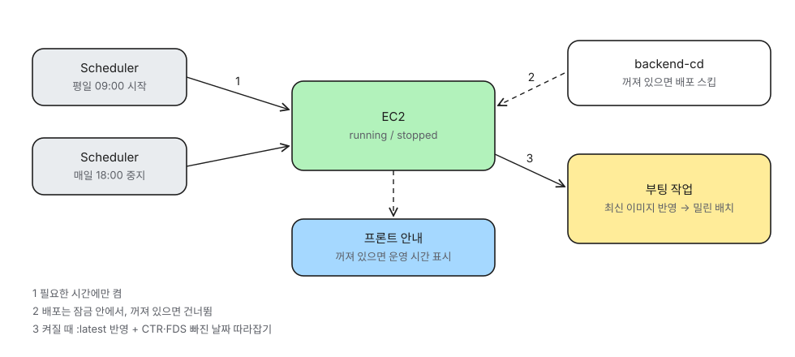

# J-Bank

계좌 원장과 이체를 코어로 하는 코어뱅킹 포트폴리오. 원장 정합성, 동시성, 멱등성을 실제 은행 시스템 원칙대로 구현하고 운영 사양에서 부하로 검증함


[www.j-bank.site](https://www.j-bank.site) · 데모 서버는 평일 09:00~18:00(KST)에만 운영



## 아키텍처



- 프론트는 Vercel, 원장·개인정보를 다루는 백엔드는 EC2 한 대 위 Docker Compose
- 외부 진입은 Caddy 80/443만. SSH 없이 배포·운영 접근 모두 SSM

## 주요 문제 해결

### 1. 지급정지 금액(hold)으로 OTP 대기 이체의 초과 출금과 원장 불일치 방지



- 대기 금액을 잔액에서 빼지 않으면 같은 잔액으로 대기 이체가 여러 건 생겨 초과 출금, 실제로 빼면 원장 합과 어긋남
- 대기 금액은 `hold_amount`로만 잡고 출금 가능 금액은 `잔액 − hold`로 파생 계산. 원장은 append-only, 확정된 이동만 기록
- 취소된 거래는 원장에 흔적이 없어 정합성 대사가 깨지지 않음

### 2. 락 순서 고정과 멱등키 유니크 제약으로 동시 이체의 교착·중복 차단



- A→B, B→A 이체가 동시에 오면 서로 상대 계좌 락을 기다리며 교착
- 두 계좌번호를 오름차순으로 정렬해 같은 순서로 비관적 락. 멱등키는 앱 확인에 더해 DB 유니크 제약으로 한 번 더
- 동시 출금·양방향 이체·같은 키 동시 요청 등 5개 시나리오를 Testcontainers(PostgreSQL)로 검증

### 3. 운영 사양 EC2 부하 테스트로 핫 계좌 병목이 API 전체로 번지는 것 확인



- 운영과 같은 t3.small에 1천만 건 시드, 별도 부하 발생기로 무너질 때까지 올림
- 한 계좌로 이체가 몰리면 초당 80~100건에서 무너짐. CPU는 46%로 여유, 행 락 대기(0.77s)가 커넥션 풀을 고갈시킴
- 그 결과 락과 무관한 잔액 조회 p95가 8ms → 1,397ms. 타임아웃을 받은 이체도 대부분 실제로는 완료돼 있었음
- 기준선과 원인 분석은 [`perf/results/ec2-baseline/`](perf/results/ec2-baseline/), 입금 비동기 반영이 다음 개선 과제

### 4. 인프라 비용을 월 $200 → $11로 줄이면서 배포·배치가 깨지지 않게 함



- EKS·RDS·ALB 구성(`v1.0.0`)을 EC2 한 대 + Docker Compose로 낮추고([ADR 0010](docs/adr/0010-ec2-single-instance.md)), 평일 낮에만 켜도록 바꿈([ADR 0011](docs/adr/0011-ec2-weekday-hours.md))
- 꺼진 시간 CD는 배포 스킵, 켜질 때 부팅 작업이 최신 이미지 반영 후 밀린 배치 실행. CD와 부팅 작업은 같은 잠금으로 순차 배포
- 서버가 꺼져 있으면 프론트가 운영 시간 안내

### 5. 1천만 건 규모에서 거래내역 조회 p95 12ms 유지

- 계좌 10만·거래 1천만 건에서 조회·이체 API 모두 p95 13ms 이하, 실패 0%
- W6에 넣은 복합 인덱스 두 개를 옵티마이저가 `BitmapOr`로 결합해 씀. [측정 기록](docs/devlog/2026-09-10_대규모1천만건성능측정.md)

## 기술 스택

| 영역 | 스택 |
|---|---|
| 백엔드 | Java 21, Spring Boot 3.5, JPA, Spring Security, Spring Batch, Flyway, Redisson |
| 프론트 | Next.js 14, TypeScript, TanStack Query, Zustand, Tailwind v4, shadcn/ui |
| 테스트 | JUnit5, ArchUnit, Testcontainers, Jest, Playwright, k6 |
| 인프라 | EC2, Docker Compose, Caddy, Terraform, GitHub Actions, Prometheus/Grafana, Vercel |

## 실행

```bash
scripts/up.sh    # Docker(PostgreSQL·Redis·관측) + 백엔드 + 프론트 한 번에
```

API http://localhost:8080/swagger-ui.html · 화면 http://localhost:3000 · 자세한 절차는 [docs/README.md](docs/README.md#로컬-개발-환경)

## 문서

- [설계 문서 11종](docs/README.md): 요구사항, ERD, API, 인프라 등
- [ADR](docs/adr/) · [개발일지](docs/devlog/) · [성능 측정](perf/README.md)
- [알려진 한계와 개선 과제](docs/11_J-Bank_알려진한계와개선과제.md)
