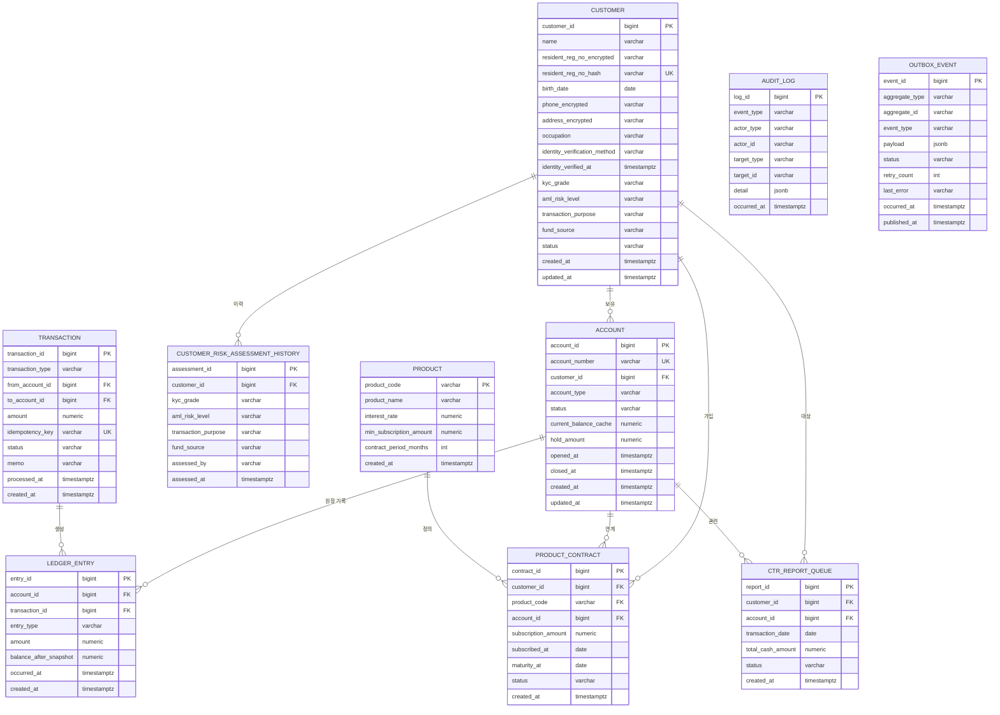
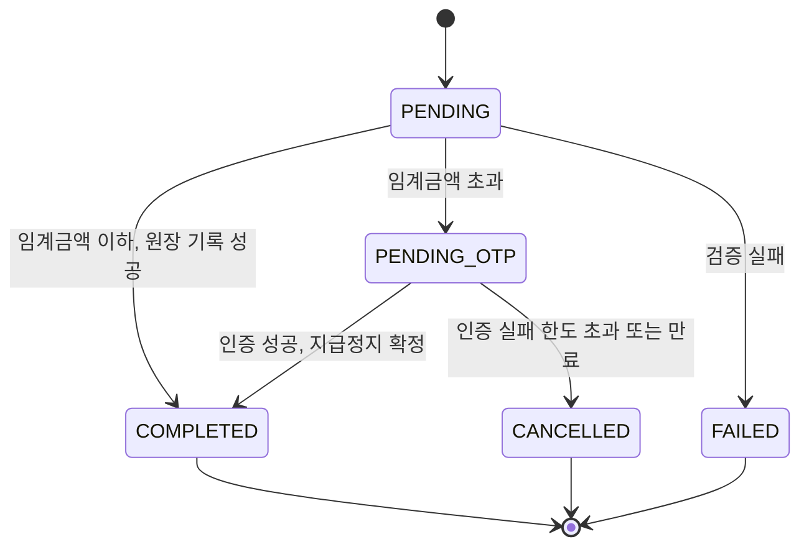

# J-Bank 코어시스템 ERD 설계

문서 버전: v1.2
작성일: 2026-07-21
최종 수정: 2026-07-26
DB: PostgreSQL 기준

## 버전 이력

| 버전 | 일자 | 변경 내용 |
|---|---|---|
| v1.0 | 2026-07-21 | 최초 작성 |
| v1.1 | 2026-07-21 | CustomerRiskAssessmentHistory, CtrReportQueue 엔티티 추가 |
| v1.2 | 2026-07-26 | Account에 지급정지 금액 컬럼 추가, OutboxEvent 테이블 신규 정의, Transaction 상태 기계 정의, 관련 인덱스 반영 |

## 1. ERD 다이어그램



AuditLog는 target_type과 target_id로 임의 엔티티를 참조하는 범용 로그 테이블이라 강한 외래키를 걸지 않고, 애플리케이션 레벨에서만 관계를 관리한다. OutboxEvent도 같은 이유로 외래키를 걸지 않는다. 두 테이블 모두 참조 대상 엔티티가 여러 종류이고, 발신함은 원본 레코드가 삭제되거나 파티션에서 분리된 뒤에도 발행 이력이 남아야 하기 때문이다.

## 2. 엔티티별 상세 스키마

### 2.1 Customer

| 컬럼 | 타입 | 제약 | 설명 |
|---|---|---|---|
| customer_id | BIGSERIAL | PK | 내부 대리키 |
| name | VARCHAR(100) | NOT NULL | 고객명 |
| resident_reg_no_encrypted | VARCHAR(255) | NOT NULL | 실명번호, 컬럼 레벨 암호화 저장 |
| resident_reg_no_hash | VARCHAR(64) | NOT NULL, UNIQUE | 실명번호 해시값, 중복 CIF 생성 방지용 조회 키 |
| birth_date | DATE | NOT NULL | 생년월일 |
| phone_encrypted | VARCHAR(255) | NOT NULL | 연락처, 암호화 저장 |
| address_encrypted | VARCHAR(500) | NULL | 주소, 암호화 저장 |
| occupation | VARCHAR(100) | NULL | 직업정보 |
| identity_verification_method | VARCHAR(20) | NOT NULL | FACE_TO_FACE 또는 NON_FACE_TO_FACE |
| identity_verified_at | TIMESTAMPTZ | NOT NULL | 실명확인 완료 시각 |
| kyc_grade | VARCHAR(20) | NOT NULL | CDD 또는 EDD |
| aml_risk_level | VARCHAR(10) | NOT NULL | LOW, MEDIUM, HIGH |
| transaction_purpose | VARCHAR(200) | NULL | EDD 대상만 필수 |
| fund_source | VARCHAR(200) | NULL | EDD 대상만 필수 |
| status | VARCHAR(20) | NOT NULL, DEFAULT 'ACTIVE' | ACTIVE, DORMANT, CLOSED |
| created_at | TIMESTAMPTZ | NOT NULL, DEFAULT now() | |
| updated_at | TIMESTAMPTZ | NOT NULL, DEFAULT now() | |

실명번호를 암호화 컬럼과 해시 컬럼으로 나눈 이유는, 신규 고객 등록 시 기존 CIF 중복 여부를 확인하려면 매번 복호화 후 비교하는 것보다 결정론적 해시(HMAC-SHA256 등)로 색인해 조회하는 편이 안전하고 빠르기 때문이다. 원문 복호화는 실명확인이나 감사 조회처럼 꼭 필요한 경우에만 수행한다.

### 2.2 Account

| 컬럼 | 타입 | 제약 | 설명 |
|---|---|---|---|
| account_id | BIGSERIAL | PK | 내부 대리키 |
| account_number | VARCHAR(20) | NOT NULL, UNIQUE | 대외 계좌번호, 은행 자체 채번 규칙(지점코드-일련번호-체크디지트) |
| customer_id | BIGINT | NOT NULL, FK → customer.customer_id | 소유 고객 |
| account_type | VARCHAR(20) | NOT NULL | CHECKING(보통예금) 등 |
| status | VARCHAR(20) | NOT NULL, DEFAULT 'ACTIVE' | ACTIVE, SUSPENDED, DORMANT, CLOSED |
| current_balance_cache | NUMERIC(19,2) | NOT NULL, DEFAULT 0 | 조회 성능용 잔액 캐시, 원장 합산 결과와 주기적으로 대사 |
| hold_amount | NUMERIC(19,2) | NOT NULL, DEFAULT 0, CHECK (hold_amount >= 0 AND hold_amount <= current_balance_cache) | 지급정지 금액. 2차 인증 대기 중인 이체 금액의 합 |
| opened_at | TIMESTAMPTZ | NOT NULL | 개설일시 |
| closed_at | TIMESTAMPTZ | NULL | 해지일시 |
| created_at / updated_at | TIMESTAMPTZ | NOT NULL | |

current_balance_cache를 둔 이유를 짚어드릴게요. FR-TXN-004는 잔액을 원장 엔트리 합산으로 계산하도록 정의되어 있는데, 이는 데이터 정합성의 근거를 원장에 두겠다는 설계 의도이지 매 조회마다 전체 원장을 스캔하라는 뜻은 아닙니다. 실무에서는 원장을 신뢰 가능한 단일 진실 공급원으로 유지하되, 조회 성능을 위해 계좌 테이블에 캐시 컬럼을 두고 트랜잭션 처리 시 함께 갱신하는 방식을 씁니다. 두 값이 어긋나면 FR-TXN-006 정합성 검증 배치가 잡아내는 구조입니다.

**hold_amount와 출금 가능 금액**

hold_amount는 v1.2에서 추가한 컬럼이다. FR-AUTH-003의 고액이체 2차 인증에서 나오는 문제를 해결하기 위한 것이다.

임계금액을 초과하는 이체는 즉시 완료되지 않고 인증 대기 상태로 남는다. 이때 대기 중인 금액을 잔액에서 차감하지 않으면 같은 잔액으로 여러 건의 대기 거래를 만들 수 있어서, 인증을 순서대로 통과시키면 잔액을 초과한 출금이 발생한다. 반대로 잔액을 실제로 차감해버리면 원장에 아직 기록되지 않은 금액이 잔액에서 사라진 상태가 되어 원장 합산과 캐시 잔액이 어긋난다.

실무에서 쓰는 해법은 잔액과 출금 가능 금액을 분리하는 것이다. 잔액은 원장에 기록된 실제 금액이고, 출금 가능 금액은 여기서 지급정지된 금액을 뺀 값이다.

```
출금 가능 금액 = current_balance_cache - hold_amount
```

출금과 이체는 잔액이 아니라 출금 가능 금액을 기준으로 검증한다. 이체가 인증 대기 상태로 들어가면 그 금액이 hold_amount에 더해지고, 인증이 완료되면 hold_amount에서 빼면서 원장에 차변 엔트리를 기록한다. 인증이 실패하거나 유효시간이 지나면 원장에 아무것도 기록하지 않고 hold_amount만 되돌린다.

이 구조의 이점은 원장이 오염되지 않는다는 것이다. 지급정지는 계좌 상태의 일부이고 원장은 확정된 금전 이동만 담는다. 인증 대기 중인 거래가 취소되어도 원장에는 흔적이 남지 않으므로, 정합성 대사가 실패하는 일이 없다.

출금 가능 금액을 별도 컬럼으로 두지 않고 파생 계산하는 이유는, 컬럼을 하나 더 두면 세 값이 서로 어긋날 수 있는 조합이 늘어나기 때문이다. 두 값만 저장하고 세 번째는 항상 계산한다.

CHECK 제약으로 hold_amount가 음수가 되거나 잔액을 초과하는 것을 막는다. 두 조건 모두 애플리케이션 로직에서 이미 보장하지만, 지급정지 해제 로직에 결함이 생겼을 때 조용히 데이터가 오염되는 대신 즉시 실패하게 만드는 편이 낫다.

이 컬럼이 실제로 쓰이는 시점은 W5의 고액이체 2차 인증이지만, 스키마에는 W1부터 포함한다. 잔액을 다루는 컬럼을 나중에 추가하면 이미 쌓인 계좌 데이터에 대한 보정 마이그레이션이 필요해진다.

### 2.3 LedgerEntry

| 컬럼 | 타입 | 제약 | 설명 |
|---|---|---|---|
| entry_id | BIGSERIAL | PK | |
| account_id | BIGINT | NOT NULL, FK → account.account_id | |
| transaction_id | BIGINT | NOT NULL, FK → transaction.transaction_id | |
| entry_type | VARCHAR(10) | NOT NULL | DEBIT 또는 CREDIT |
| amount | NUMERIC(19,2) | NOT NULL, CHECK (amount > 0) | |
| balance_after_snapshot | NUMERIC(19,2) | NOT NULL | 해당 엔트리 반영 직후 잔액 스냅샷 |
| occurred_at | TIMESTAMPTZ | NOT NULL | |
| created_at | TIMESTAMPTZ | NOT NULL, DEFAULT now() | |

이 테이블은 append-only로만 사용하고 UPDATE, DELETE는 애플리케이션 레벨에서 금지한다. 리포지토리에서 해당 메서드를 노출하지 않고, JPA 엔티티 리스너에서 `@PreUpdate`와 `@PreRemove` 시 예외를 던지는 이중 방어를 둔다. 데이터량이 커질 것을 감안해 Phase 3에서는 occurred_at 기준 월별 파티셔닝을 고려한다.

balance_after_snapshot은 지급정지를 반영하지 않은 잔액이다. 원장은 확정된 금전 이동만 담으므로 스냅샷도 잔액 기준이며, 출금 가능 금액은 계좌 테이블에서만 계산한다.

### 2.4 Transaction

| 컬럼 | 타입 | 제약 | 설명 |
|---|---|---|---|
| transaction_id | BIGSERIAL | PK | |
| transaction_type | VARCHAR(20) | NOT NULL | DEPOSIT, WITHDRAWAL, TRANSFER |
| from_account_id | BIGINT | NULL, FK → account.account_id | 출금 계좌, 입금 단독 거래 시 NULL |
| to_account_id | BIGINT | NULL, FK → account.account_id | 입금 계좌, 출금 단독 거래 시 NULL |
| amount | NUMERIC(19,2) | NOT NULL, CHECK (amount > 0) | |
| idempotency_key | VARCHAR(64) | NOT NULL, UNIQUE | 클라이언트가 제공하는 멱등성 키 |
| status | VARCHAR(20) | NOT NULL | 아래 상태 기계 참조 |
| memo | VARCHAR(200) | NULL | |
| processed_at | TIMESTAMPTZ | NULL | |
| created_at | TIMESTAMPTZ | NOT NULL, DEFAULT now() | |

idempotency_key에 유니크 제약을 걸어두면, 동시에 같은 키로 두 요청이 들어와도 DB가 두 번째 삽입을 유니크 제약 위반으로 막아준다. 애플리케이션 로직의 중복 확인과 DB 제약을 이중으로 두는 편이 안전하다.

**거래 상태 기계**

v1.0은 status를 PENDING, COMPLETED, FAILED 세 가지로 정의했는데, 2차 인증 대기와 대기 만료를 표현할 수 없었다. API설계 문서가 이미 `PENDING_OTP`를 사용하고 있어 두 문서가 어긋난 상태였다. v1.2에서 다섯 가지로 확장하고 허용 전이를 명시한다.

| 상태 | 의미 |
|---|---|
| PENDING | 처리 시작, 원장 기록 전 |
| PENDING_OTP | 임계금액 초과로 2차 인증 대기, 지급정지 설정됨 |
| COMPLETED | 원장 기록 완료 |
| FAILED | 검증 실패 또는 처리 중 오류 |
| CANCELLED | 인증 실패 한도 초과 또는 유효시간 경과로 취소, 지급정지 해제됨 |



COMPLETED, FAILED, CANCELLED는 종료 상태이며 어떤 전이도 허용하지 않는다. 이 규칙은 애플리케이션 레벨에서 명시적인 상태 기계로 구현하고, 허용되지 않은 전이 시도에는 예외를 던진다. 금융 거래에서 종료된 거래의 상태가 다시 바뀌는 것은 어떤 경로로도 허용되지 않아야 한다.

### 2.5 Product / ProductContract

Product: product_code(PK), product_name, interest_rate NUMERIC(5,4), min_subscription_amount NUMERIC(19,2), contract_period_months INT.

ProductContract: contract_id(PK), customer_id(FK), product_code(FK), account_id(FK), subscription_amount, subscribed_at, maturity_at, status(ACTIVE/MATURED/TERMINATED).

정기예금처럼 계좌 자체가 곧 상품 계약인 경우와, 자유적립식 적금처럼 별도 입출금 계좌에서 자동이체로 적립하는 경우가 모두 있어서, account_id를 통해 계약과 계좌를 느슨하게 연결하는 구조로 뒀다.

### 2.6 CustomerRiskAssessmentHistory

| 컬럼 | 타입 | 제약 | 설명 |
|---|---|---|---|
| assessment_id | BIGSERIAL | PK | |
| customer_id | BIGINT | NOT NULL, FK → customer.customer_id | |
| kyc_grade | VARCHAR(20) | NOT NULL | |
| aml_risk_level | VARCHAR(10) | NOT NULL | |
| transaction_purpose | VARCHAR(200) | NULL | |
| fund_source | VARCHAR(200) | NULL | |
| assessed_by | VARCHAR(50) | NOT NULL | SYSTEM 또는 운영자 ID |
| assessed_at | TIMESTAMPTZ | NOT NULL | |

Customer 테이블은 현재 시점의 KYC등급과 AML위험도만 들고 있는데, 감독당국 검사 시에는 특정 시점에 왜 그 등급으로 판단했는지 근거를 제출해야 한다. 그래서 등급이 바뀔 때마다 이 이력 테이블에 스냅샷을 남긴다.

### 2.7 CtrReportQueue

| 컬럼 | 타입 | 제약 | 설명 |
|---|---|---|---|
| report_id | BIGSERIAL | PK | |
| customer_id | BIGINT | NOT NULL, FK → customer.customer_id | |
| account_id | BIGINT | NOT NULL, FK → account.account_id | |
| transaction_date | DATE | NOT NULL | |
| total_cash_amount | NUMERIC(19,2) | NOT NULL | |
| status | VARCHAR(20) | NOT NULL | PENDING, LOGGED |
| created_at | TIMESTAMPTZ | NOT NULL, DEFAULT now() | |

FR-SUP-004의 판별 결과를 적재하는 큐 테이블. 실제 전송 대신 로그 출력으로 대체하기로 한 부분이라 status는 PENDING과 LOGGED 두 가지만 쓴다.

### 2.8 AuditLog

| 컬럼 | 타입 | 제약 | 설명 |
|---|---|---|---|
| log_id | BIGSERIAL | PK | |
| event_type | VARCHAR(50) | NOT NULL | 예: ACCOUNT_STATUS_CHANGED, TRANSFER_COMPLETED |
| actor_type | VARCHAR(20) | NOT NULL | CUSTOMER, SYSTEM, OPERATOR |
| actor_id | VARCHAR(50) | NULL | |
| target_type | VARCHAR(50) | NOT NULL | ACCOUNT, CUSTOMER, TRANSACTION 등 |
| target_id | VARCHAR(50) | NOT NULL | |
| detail | JSONB | NULL | 변경 전/후 값 등 구조화된 상세 |
| occurred_at | TIMESTAMPTZ | NOT NULL | |

### 2.9 OutboxEvent (v1.2 신규)

| 컬럼 | 타입 | 제약 | 설명 |
|---|---|---|---|
| event_id | BIGSERIAL | PK | |
| aggregate_type | VARCHAR(50) | NOT NULL | 이벤트를 발생시킨 엔티티 종류. TRANSACTION, ACCOUNT, CUSTOMER |
| aggregate_id | VARCHAR(50) | NOT NULL | 해당 엔티티 식별자 |
| event_type | VARCHAR(50) | NOT NULL | TRANSFER_COMPLETED, ACCOUNT_STATUS_CHANGED 등 |
| payload | JSONB | NOT NULL | 발행할 이벤트 본문 |
| status | VARCHAR(20) | NOT NULL, DEFAULT 'PENDING' | PENDING, PUBLISHED, FAILED |
| retry_count | INT | NOT NULL, DEFAULT 0 | 발행 재시도 횟수 |
| last_error | VARCHAR(500) | NULL | 마지막 발행 실패 사유 |
| occurred_at | TIMESTAMPTZ | NOT NULL | 이벤트 발생 시각, 원본 트랜잭션 커밋 시각 |
| published_at | TIMESTAMPTZ | NULL | 발행 성공 시각 |

**이 테이블이 필요한 이유**

데이터베이스 커밋과 메시지 발행 사이에는 원자성이 없다. 커밋 후에 발행하도록 걸어두면 커밋 직후 애플리케이션이 죽었을 때 메시지가 영영 발행되지 않는다. 반대로 커밋 전에 발행하면 트랜잭션이 롤백됐는데 이벤트만 나가는 상황이 생긴다. 이체 완료 알림에서 앞의 경우는 알림 누락이고 뒤의 경우는 발생하지 않은 이체를 알리는 것이므로, 금융 거래에서 둘 다 허용되지 않는다.

해법은 이벤트를 메시지 브로커가 아니라 같은 데이터베이스에 먼저 쓰는 것이다. 이체 트랜잭션 안에서 원장 엔트리와 이 테이블의 레코드를 함께 커밋하면, 둘은 같은 트랜잭션이므로 원자성이 보장된다. 그 뒤 별도 발행기가 PENDING 상태 레코드를 폴링해 Kafka로 보내고 상태를 PUBLISHED로 갱신한다.

이 구조는 최소 한 번 전달을 보장한다. 발행 후 상태 갱신 전에 죽으면 같은 이벤트가 두 번 발행되지만, 중복은 소비자 측 멱등 처리로 흡수한다. 유실보다 중복이 다루기 쉽다는 판단이다.

**부분 인덱스**

미발행 레코드만 골라내는 조회가 폴링 주기마다 반복되므로 status가 PENDING인 행만 담는 부분 인덱스를 건다.

```sql
CREATE INDEX idx_outbox_pending
    ON outbox_event (occurred_at)
    WHERE status = 'PENDING';
```

이 인덱스는 초기부터 넣는다. 발신함은 발행이 끝난 레코드가 계속 쌓이는 구조라, 인덱스 없이 두면 전체 테이블에서 소수의 미발행 행을 찾는 비용이 시간에 비례해 나빠진다. 전체 인덱스가 아니라 부분 인덱스를 쓰는 이유는 인덱스 크기가 미발행 행 수에 비례해 유지되기 때문이다. 정상 운영 상태에서 미발행 행은 항상 소수이므로 인덱스가 거의 비어 있는 상태로 유지된다.

발행이 끝난 레코드는 일정 기간 보관 후 정리하는 배치를 Phase 3에서 추가한다. 즉시 삭제하지 않는 이유는 발행 이력 자체가 추적 자료이기 때문이다.

## 3. 인덱스 설계

| 테이블 | 인덱스 | 목적 |
|---|---|---|
| customer | UNIQUE(resident_reg_no_hash) | CIF 중복 방지 |
| account | UNIQUE(account_number), INDEX(customer_id) | 계좌 조회, 고객별 계좌 목록 |
| ledger_entry | INDEX(account_id, occurred_at), INDEX(transaction_id) | 거래내역 조회, 잔액 계산 |
| transaction | UNIQUE(idempotency_key), INDEX(from_account_id), INDEX(to_account_id) | 멱등성 보장, 계좌별 거래 조회 |
| transaction | INDEX(status, created_at) WHERE status = 'PENDING_OTP' | 만료된 대기 거래 정리 스케줄러 |
| product_contract | INDEX(customer_id), INDEX(maturity_at) | 고객별 계약 조회, 만기 배치 대상 조회 |
| audit_log | INDEX(occurred_at), INDEX(target_type, target_id) | 기간별 조회, 대상별 조회 |
| ctr_report_queue | INDEX(transaction_date) | 일자별 배치 조회 |
| outbox_event | INDEX(occurred_at) WHERE status = 'PENDING' | 미발행 이벤트 폴링 |

이 표의 인덱스 가운데 두 개의 부분 인덱스만 초기부터 생성한다. 나머지 조회용 인덱스는 구현계획 7.3절에 따라 W6의 측정 후에 근거와 함께 반영한다. 부분 인덱스 두 개를 예외로 두는 이유는 둘 다 폴링이나 스케줄러가 주기적으로 반복 실행하는 조회이고, 테이블이 커질수록 비용이 나빠지는 구조여서 데이터가 적을 때 넣어두는 편이 낫기 때문이다.

## 4. 설계 노트

- 모든 PK는 대리키(BIGSERIAL)를 쓰고, 계좌번호처럼 외부에 노출되는 값은 별도 UNIQUE 컬럼으로 둔다. 대리키를 노출하면 내부 데이터량 추정이나 순차 추측 공격에 노출될 수 있어서다.
- 금액 컬럼은 부동소수점 오차를 피하기 위해 전부 NUMERIC(19,2)로 통일한다.
- ledger_entry, transaction, audit_log, outbox_event는 데이터가 계속 쌓이는 append-only 테이블이라 Phase 3에서 월별 range 파티셔닝을 적용해 조회 성능과 백업 효율을 확보한다.
- 실명번호, 연락처, 주소는 애플리케이션 레벨 암호화(AES-256-GCM)로 저장하고, DB 자체 암호화를 추가로 얹는 이중 방어를 권장한다.
- 잔액과 관련된 컬럼은 current_balance_cache와 hold_amount 두 개뿐이고, 출금 가능 금액은 항상 파생 계산한다. 저장하는 값의 수를 최소로 유지하는 것이 정합성 관리 비용을 낮춘다.

## 5. 요구사항명세서와의 정합성

v1.2에서 추가한 두 항목은 요구사항명세서에도 반영했다.

지급정지 금액과 출금 가능 금액의 정의는 요구사항명세서 1.3절 용어 정의와 FR-TXN-002 출금 처리에 들어갔다. 발신함은 5절 데이터 요구사항의 엔티티 표에 추가했다.

거래 상태 기계 확장은 요구사항명세서에 별도 항목으로 넣지 않았다. 상태 목록 자체가 FR-TXN-003과 FR-AUTH-003의 처리 절차에서 파생되는 구현 수준의 정의이고, API설계 문서가 이미 상태값을 응답 계약으로 노출하고 있어서 이 문서와 API설계 문서만 일치하면 충분하다고 판단했다.
