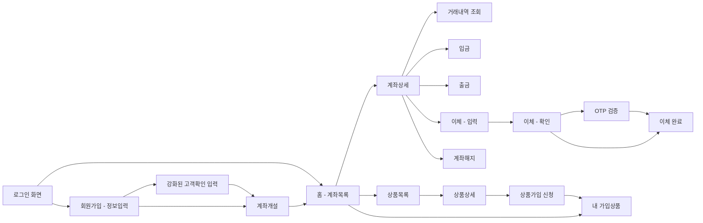
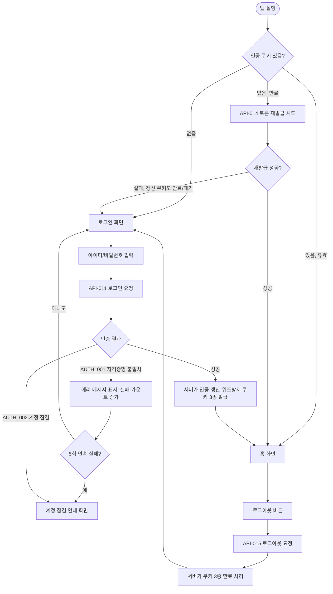
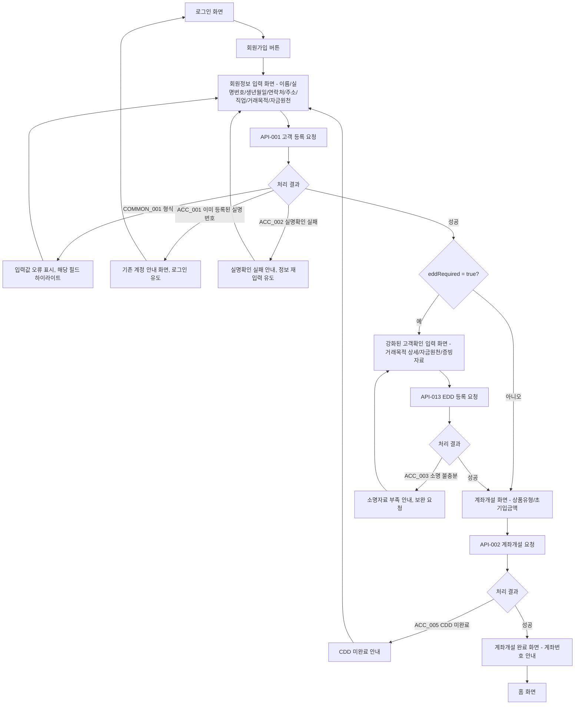
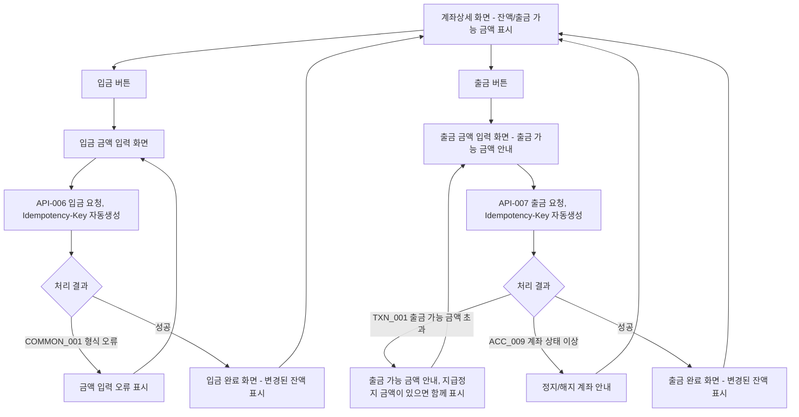
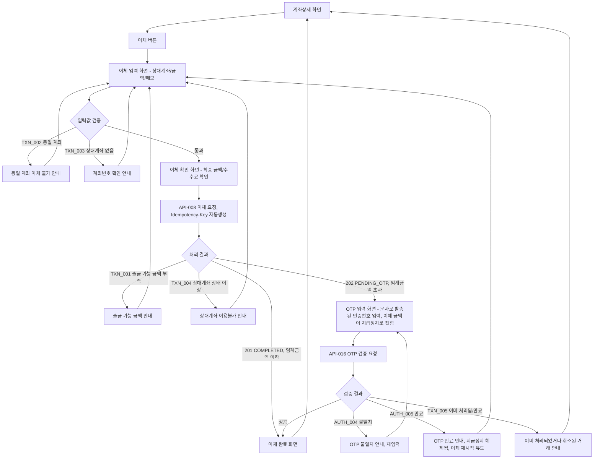
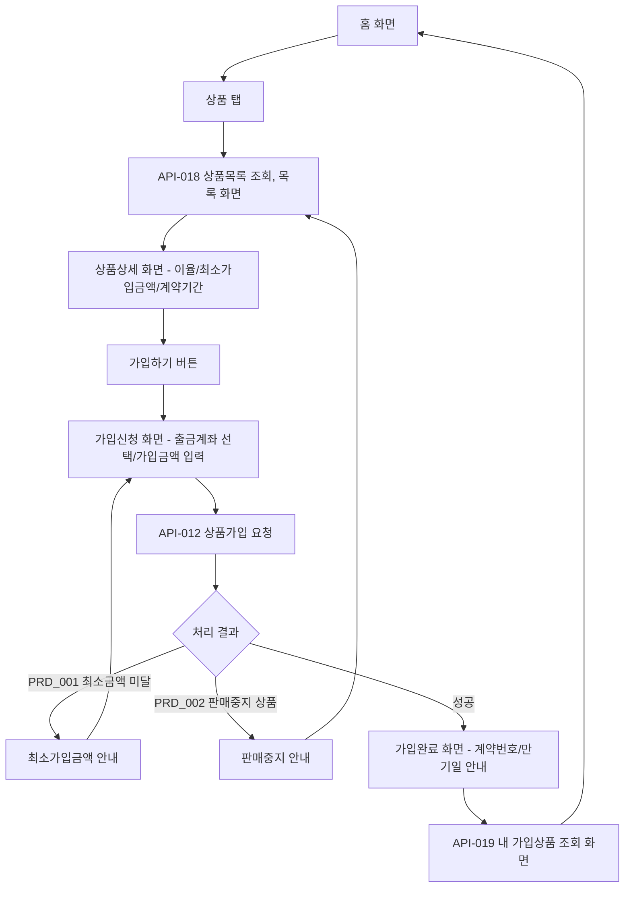
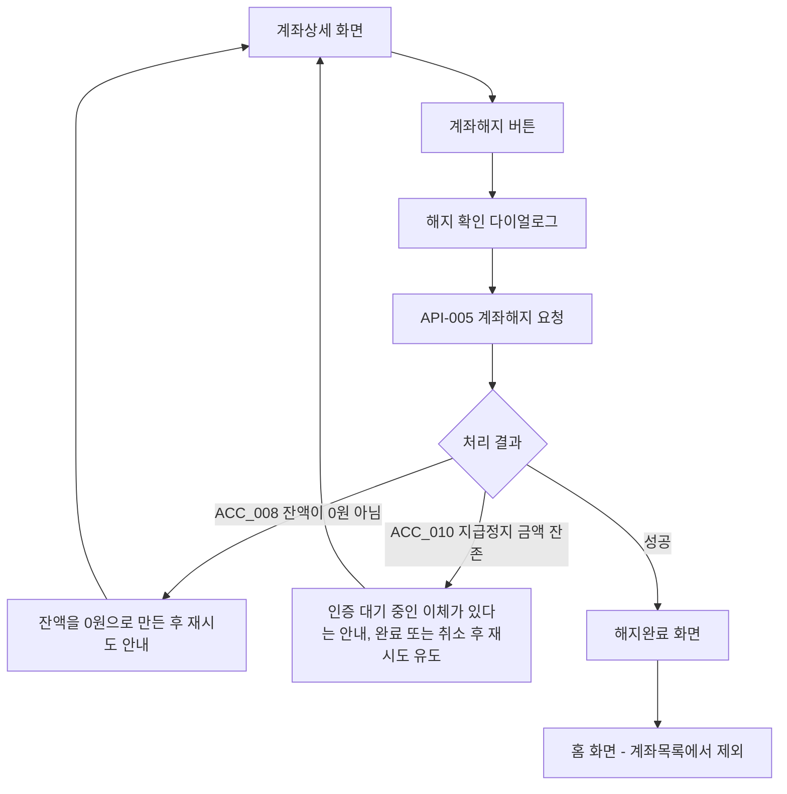

# J-Bank 코어시스템 화면 플로우차트

## 버전 이력

| 버전 | 일자 | 변경 내용 |
|---|---|---|
| v1.0 | 2026-07-21 | 최초 작성 - Phase 1+2 고객용 화면 전체에 대한 화면 전환 플로우차트 작성 |
| v1.1 | 2026-07-26 | 프로젝트명을 J-Bank로 변경. 인증 플로우의 토큰 저장 노드를 쿠키 기반으로 수정, 출금 가능 금액과 지급정지 개념을 입출금·이체 플로우에 반영 |

## 관련 문서

- J-Bank_요구사항명세서.md
- J-Bank_API설계.md
- J-Bank_프론트엔드기술스택.md

---

## 1. 문서 개요

이 문서는 프론트엔드 화면 설계와 라우팅 구조를 잡기 위한 화면 전환 플로우차트다. API설계.md가 서버 관점에서 "어떤 엔드포인트가 무엇을 주고받는가"를 다뤘다면, 이 문서는 클라이언트 관점에서 "사용자가 어떤 화면에서 어떤 행동을 하면 다음에 어떤 화면으로 가는가"를 다룬다.

범위는 Phase 1과 Phase 2에 해당하는 고객용 화면이다. 운영자 전용 화면(감사로그 조회, CTR 대상 조회, 이상거래 조회)은 별도의 관리자 콘솔 성격이 강해 이번 범위에서 제외했으며, 필요해지면 별도 문서로 다룬다.

각 다이어그램의 사각형 노드는 화면, 마름모 노드는 서버 응답이나 입력값에 따른 분기, 화살표 라벨은 사용자 행동 또는 API 처리 결과를 의미한다. 각 분기에 표기된 코드(예: `TXN_001`)는 API설계.md에 정의된 에러코드와 동일하므로, 프론트엔드에서 에러 핸들링 로직을 짤 때 이 문서와 API설계.md를 함께 참조하면 된다.

## 2. 전체 화면 구조도

전체 화면이 어떻게 연결되는지 한눈에 보기 위한 사이트맵이다. 세부 분기는 3절 이후 개별 플로우에서 다룬다.

## 3. 앱 진입 및 인증 플로우

앱 실행 시점부터 로그인, 토큰 재발급, 로그아웃까지의 흐름이다. 인증 쿠키의 유효성에 따라 홈으로 바로 진입할지, 조용히 재발급을 시도할지, 로그인 화면으로 보낼지가 갈린다.

프론트엔드 구현 시 참고할 점이 세 가지다.

첫째, 토큰 재발급은 사용자에게 별도 화면을 보여주지 않고 백그라운드에서 조용히 처리해야 한다. 인증 쿠키 만료로 API 호출이 401을 반환하면, 그 시점에 API-014를 자동 호출하고 원래 요청을 재시도하는 인터셉터 패턴으로 구현하는 것이 일반적이다.

둘째, 클라이언트가 토큰 값을 저장하는 단계가 없다는 점이다. 서버가 `Set-Cookie`로 내려주고 브라우저가 보관하며, 인증 쿠키와 갱신 쿠키는 스크립트가 읽을 수 없다. 로그아웃도 로컬 저장소를 비우는 것이 아니라 서버가 쿠키를 만료시키는 방식이다.

셋째, 동시에 여러 요청이 401을 받는 경우를 처리해야 한다. 각 요청이 독립적으로 재발급을 시도하면 갱신 토큰 로테이션 때문에 두 번째 요청 이후가 이미 사용된 토큰을 제출하게 되고, 서버가 이를 탈취로 판단해 토큰 계열 전체를 폐기한다. 재발급 요청을 하나로 합치고 나머지는 그 결과를 기다리게 해야 한다.

## 4. 회원가입 및 계좌개설 플로우

신규 고객이 정보를 입력하는 시점부터 CDD, 필요 시 EDD, 계좌개설까지 이어지는 흐름이다. `eddRequired` 값에 따라 분기하는 지점이 프론트엔드 라우팅에서 가장 신경 써야 할 부분이다.

`ACC_005 CDD 미완료` 분기는 정상 흐름에서는 발생하지 않아야 하지만, 회원가입과 계좌개설 사이에 세션이 끊기거나 다른 기기에서 이어서 진행하는 경우를 대비한 방어적 분기다.

## 5. 입출금 플로우

계좌상세 화면에서 입금과 출금으로 각각 진입하는 흐름이다. 둘 다 `Idempotency-Key`를 프론트엔드에서 요청 시점에 자동 생성해 헤더에 실어야 한다는 점이 공통이다.

`Idempotency-Key`는 화면 진입 시점이 아니라 실제 제출 버튼을 누르는 시점에 생성해야 한다. 화면 진입 시점에 미리 만들어두면, 사용자가 금액을 여러 번 고쳐 입력한 뒤 제출해도 같은 키가 재사용되어 최초 입력값 기준으로 멱등 처리가 꼬일 수 있다.

출금 거절 안내에는 잔액이 아니라 출금 가능 금액을 기준으로 써야 한다. 2차 인증 대기 중인 이체가 있으면 잔액은 그대로인데 출금 가능 금액만 줄어들기 때문에, 잔액만 보여주면 사용자가 "잔액이 충분한데 왜 거절되는가"를 이해할 수 없다. 두 값이 다를 때만 지급정지된 금액을 함께 노출한다.

## 6. 계좌이체 플로우

가장 복잡한 흐름이다. 입력값 자체 검증, 출금 가능 금액과 상대계좌 상태에 따른 분기, 그리고 임계금액 초과 시 OTP 화면으로 빠지는 분기까지 세 단계의 분기가 겹쳐 있다.

프론트엔드에서는 API-008 응답의 HTTP 상태코드로 분기해야 한다. 201이면 이체 확인 화면에서 바로 이체 완료 화면으로 넘어가고, 202면 응답에 담긴 `transactionId`를 들고 OTP 화면으로 이동해야 한다.

`TXN_002`, `TXN_003`은 이체 확인 화면까지 가기 전, 입력 화면 단계의 클라이언트 사이드 검증이나 서버 사전 검증으로 걸러지는 것이 이상적이지만, 서버가 최종적으로 다시 검증하므로 이체 확인 화면에서도 이 에러가 돌아올 수 있다. 두 지점 모두에 에러 핸들링을 넣어야 한다.

202 응답을 받은 시점에 이체 금액이 출금계좌의 지급정지 금액으로 잡힌다는 점을 화면에도 반영해야 한다. OTP 화면에 머무는 동안 사용자가 다른 탭에서 계좌를 조회하면 출금 가능 금액이 줄어 있는 것이 정상이므로, OTP 화면에 대기 중인 금액을 명시해두면 혼란을 줄일 수 있다. 인증이 만료되거나 취소되면 지급정지가 해제되므로, OTP 만료 안내 후 계좌 화면으로 돌아갈 때 계좌 관련 조회를 무효화해 최신 값을 다시 받아야 한다.

## 7. 상품가입 플로우

## 8. 계좌해지 플로우

잔액이 0원이어도 지급정지 금액이 남아 있으면 2차 인증 대기 중인 이체가 존재한다는 뜻이므로 해지가 거절된다. 두 에러를 같은 문구로 처리하면 사용자가 무엇을 해야 하는지 알 수 없으니 분리해서 안내한다.

## 9. 프론트엔드 구현 시 참고사항

공통 에러 처리는 화면마다 개별로 짜기보다, API설계.md 2.7절의 공통 에러코드(`COMMON_001`~`COMMON_007`)는 전역 인터셉터에서 한 번에 처리하고, 도메인 에러코드(`ACC_`, `TXN_`, `AUTH_`, `PRD_` 접두어)만 각 화면에서 개별 처리하는 구조를 권장한다. 이렇게 나누면 이 문서의 각 플로우에 그려진 도메인 에러 분기만 화면별로 구현하면 되고, 인증 만료나 서버 오류, 위조 방지 토큰 불일치 같은 공통 케이스는 신경 쓸 필요가 없어진다.

화면 전환은 이 문서에 그려진 순서를 그대로 라우터의 페이지 스택으로 옮기면 된다. 예를 들어 이체 플로우는 이체입력 → 이체확인 → (OTP입력) → 이체완료 순으로 뒤로가기 스택이 쌓이되, 이체완료 화면에서 뒤로가기를 누르면 이체입력이 아니라 계좌상세로 바로 돌아가도록 스택을 정리하는 처리가 필요하다. 이는 이체 완료 후 실수로 중복 이체 화면으로 돌아가는 것을 막기 위함이다.

금액을 바꾸는 요청 이후에는 계좌 관련 조회를 무효화해 최신 잔액과 출금 가능 금액을 다시 받아야 한다. 무효화 시점은 입출금과 이체의 완료 응답, 그리고 2차 인증의 대기 진입과 완료·취소 시점 전부다. 대기 진입 시점을 빠뜨리면 지급정지가 반영되지 않은 출금 가능 금액이 화면에 남는다.
