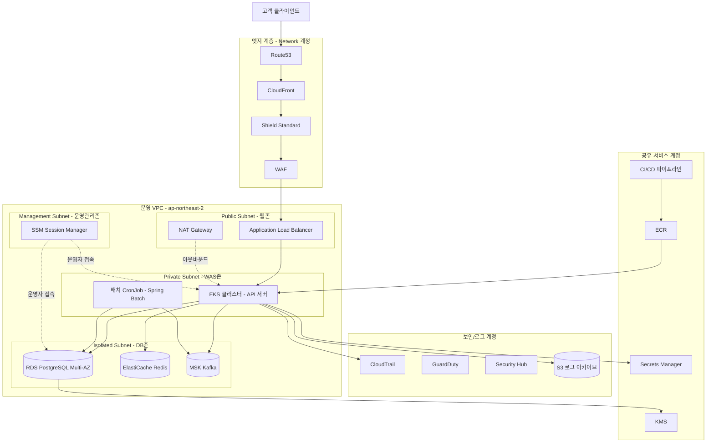

# J-Bank 코어시스템 인프라 아키텍처

## 버전 이력

| 버전 | 일자 | 변경 내용 |
|---|---|---|
| v1.0 | 2026-07-21 | 최초 작성 - 전체 인프라 아키텍처, AWS 계정 구조, 네트워크/컴퓨트/데이터/보안 계층 설계 |
| v1.1 | 2026-07-21 | 프론트엔드 호스팅을 Vercel로 분리하는 결정을 13절에 반영. 원장·개인정보 처리 영역은 AWS에 유지하는 경계를 명시 |
| v1.2 | 2026-07-26 | 프로젝트명을 J-Bank로 변경. 배치 워크로드를 API와 같은 이미지로 운영하는 방식과 발신함 발행기의 배치 위치를 명시 |

## 관련 문서

- J-Bank_요구사항명세서.md
- J-Bank_ERD.md
- J-Bank_구현계획.md
- J-Bank_폴더구조.md

---

## 1. 문서 개요

이 문서는 J-Bank 코어시스템의 배포 및 운영 인프라를 정의한다. 요구사항명세서와 ERD가 "무엇을 만들 것인가"를 다룬다면, 이 문서는 "어떤 환경에서 어떻게 운영할 것인가"를 다룬다.

설계의 기준점은 실제 국내 금융권이 운영계 인프라를 구성할 때 따르는 원칙과 관례이다. 다만 이 시스템은 실제 금융업 인가를 받은 사업자가 아니라 개인이 구축하는 프로젝트이므로, 물리적 인프라 투자나 규제기관 승인이 필요한 항목은 그대로 재현할 수 없다. 이런 항목은 왜 실제 방식(A)을 그대로 적용할 수 없는지 먼저 설명한 뒤, 실무 취지를 최대한 살린 대안(B)을 제시하는 방식으로 서술한다. 이 문서의 13절에 전체 대안 적용 내역을 표로 정리해 두었다.

## 2. 설계 원칙

금융권 인프라 설계에서 일반적으로 지켜지는 원칙은 다음과 같다.

첫째, 망분리 원칙이다. 전자금융감독규정은 전자금융기반시설의 정보처리시스템에 대해 외부 인터넷망과 내부 업무망을 분리하도록 요구한다. 원칙은 물리적 분리이며, 클라우드 이용 시에는 논리적 분리를 조건부로 인정하는 방향으로 가이드라인이 발전해왔다.

둘째, 최소권한 원칙이다. 서비스 계정, 운영자 계정, CI/CD 파이프라인 모두 필요한 최소한의 권한만 부여하고, 권한 부여 이력을 감사 가능하게 남긴다.

셋째, 심층 방어이다. 하나의 통제가 뚫려도 다음 계층에서 막을 수 있도록 네트워크, 애플리케이션, 데이터, 계정 각 계층에 독립적인 보안 통제를 둔다.

넷째, 무중단과 이중화이다. 계정계 시스템은 단일 장애점을 허용하지 않는 것이 원칙이며, 가용영역 이중화와 자동 장애조치를 기본으로 한다.

다섯째, 감사 가능성이다. 모든 거래와 모든 운영 행위는 사후 추적이 가능해야 하며, 로그는 위변조가 불가능한 형태로 일정 기간 보존되어야 한다.

여섯째, 변경관리 통제이다. 운영계에 반영되는 모든 변경은 승인 절차를 거치며, 배포 이력과 승인 이력이 남는다.

이 문서의 이후 절은 이 여섯 가지 원칙을 AWS 리소스로 어떻게 구현하는지, 그리고 개인 프로젝트 환경에서 어떤 부분을 축소 적용했는지를 설명한다.

## 3. 전체 시스템 아키텍처

계층별 역할은 다음과 같다.

엣지 계층은 Route53으로 도메인을 관리하고, CloudFront로 정적 자원과 API 앞단 캐시/가속을 처리하며, Shield와 WAF로 DDoS와 웹 공격을 1차 방어한다.

웹존은 ALB가 TLS 종료와 라우팅을 담당하고, NAT Gateway가 프라이빗 서브넷의 아웃바운드 인터넷 통신을 대행한다.

WAS존은 EKS 클러스터에서 Spring Boot API 서버가 동작하고, 배치 워크로드가 이자 계산, 정합성 대사, 고액현금거래 판별 같은 일 배치 작업을 수행한다. 이 존은 인터넷에서 직접 접근할 수 없다.

DB존은 RDS, ElastiCache, MSK가 위치하며 WAS존에서만 접근 가능하다. 인터넷 라우팅 자체가 없는 완전 격리 서브넷이다.

관리존은 운영자가 SSM Session Manager를 통해서만 접근하며, SSH 포트를 직접 열어두지 않는다.

## 4. AWS 계정 구조

### 4.1 실제 금융권의 관례

실제 금융권 또는 규모 있는 조직은 AWS Organizations와 Control Tower를 이용해 다계정 전략을 쓴다. 통상 Management 계정, Log Archive 계정, Security Tooling 계정, Network 계정, Shared Services 계정, 그리고 Dev/Staging/Prod 환경별 계정을 최소 7~10개 분리 운영한다. 계정 자체가 최상위 보안 경계이므로, 운영 계정에 문제가 생겨도 로그 계정이나 보안 계정은 독립적으로 안전하게 유지된다.

### 4.2 이 프로젝트에서 왜 그대로 적용하지 않는가

Control Tower 랜딩존을 구성하면 계정마다 기본으로 CloudTrail, Config, GuardDuty 등이 활성화되고 계정별 NAT Gateway, VPC 등 고정비용이 발생하는 리소스가 중복 생성된다. 개인이 학습 및 시연 목적으로 운영하는 프로젝트에서 계정을 7개 이상 분리하면 월 고정비용이 실질적인 활용도 대비 과도해지고, Cross-account IAM Role을 통한 계정 간 권한 위임 설정에 드는 관리 부담도 시연 목적에 비해 크다.

### 4.3 대안 적용

단일 AWS 계정 안에서 VPC 분리, 태그 기반 리소스 그룹핑, IAM 역할 분리로 논리적 경계를 재현한다. 다음 표는 실제 구조와 이 프로젝트의 적용을 비교한 것이다.

| 구분 | 실제 금융권 관례 | 이 프로젝트 적용 |
|---|---|---|
| 계정 수 | 7~10개 이상 분리 | 단일 계정, VPC/태그로 논리적 분리 |
| 로그 격리 | 별도 Log Archive 계정 | 동일 계정 내 별도 S3 버킷 + 버킷 정책으로 쓰기 전용 격리 |
| 네트워크 관리 | 별도 Network 계정에서 Transit Gateway 중앙관리 | 단일 VPC 내 서브넷 분리 |
| 환경 분리 | 계정 단위로 Dev/Staging/Prod 완전 분리 | 동일 계정 내 VPC 또는 네임스페이스 단위 분리, Terraform workspace로 상태 분리 |

이후 절에서 서술하는 아키텍처는 단일 계정을 전제로 하되, 실제로 계정을 나눌 경우 어느 경계에서 나뉘는지를 각 절에서 함께 표기한다.

## 5. 네트워크 설계

### 5.1 실제 방식(A)과 그 한계

전자금융감독규정은 원칙적으로 물리적 망분리를 요구한다. 별도의 스위치, 별도의 회선, 별도의 데이터센터 랙으로 인터넷 구간과 업무 구간을 물리적으로 나누는 방식이다. 개인 프로젝트는 물리 장비나 전용회선을 구축할 수 있는 위치에 있지 않으므로 이 방식은 그대로 적용할 수 없다.

### 5.2 대안 적용(B)

VPC 서브넷 분리와 보안그룹, NACL, VPC 엔드포인트를 조합해 논리적 망분리를 구현한다. 실제로 금융권 클라우드 이용 가이드라인도 최근에는 일정 요건을 충족하는 논리적 망분리를 제한적으로 인정하는 방향으로 개정되어 왔으므로, 이 구조는 목업이라기보다 실제로도 통용되는 대안 모델에 가깝다.

| 서브넷 | 배치 리소스 | 라우팅 |
|---|---|---|
| Public Subnet | ALB, NAT Gateway | 인터넷 게이트웨이로 직접 라우팅 |
| Private Subnet(WAS존) | EKS 워커노드, 배치 CronJob | NAT Gateway 경유로만 아웃바운드 가능 |
| Isolated Subnet(DB존) | RDS, ElastiCache, MSK | 인터넷 라우팅 없음, VPC 내부 통신만 허용 |
| Management Subnet | SSM 엔드포인트 | 인터넷 라우팅 없음, VPC 엔드포인트로만 AWS API 통신 |

보안그룹은 계층 간 화이트리스트 방식으로 구성한다. ALB 보안그룹은 443 포트만 인바운드 허용하고, WAS 보안그룹은 ALB 보안그룹으로부터의 트래픽만 허용하며, DB 보안그룹은 WAS 보안그룹으로부터의 트래픽만 허용한다. 관리 서브넷에서 DB존으로의 직접 접속은 운영 데이터베이스 점검 목적의 예외 규칙으로만 열어두고 상시 접속은 차단한다.

PrivateLink 기반 VPC 엔드포인트를 S3, KMS, Secrets Manager, ECR에 구성해 WAS존에서 AWS API를 호출할 때도 인터넷 구간을 거치지 않도록 한다. 이는 실제 은행이 내부망에서 외부 인터넷 경유 없이 필요한 서비스에 접근하는 구조를 클라우드 환경에서 재현한 것이다.

## 6. 컴퓨트 계층

Phase 1에서는 EKS 클러스터에 Spring Boot 애플리케이션을 배포한다. 최소 2개 가용영역에 걸쳐 워커노드를 분산 배치하고, Horizontal Pod Autoscaler로 트래픽에 따라 파드 수를 조정한다.

배치 작업은 별도 노드 그룹에서 Kubernetes CronJob으로 실행해 API 서비스와 자원을 분리한다. 여기서 한 가지 짚어둘 점은 배치가 별도 이미지가 아니라는 것이다. 배치 잡은 API 서버와 같은 애플리케이션 안의 `batch` 패키지에 있고, CronJob은 동일한 이미지 태그를 참조하면서 실행 인자와 노드 선택자만 다르게 준다. 이미지를 둘로 나누면 빌드 파이프라인이 둘로 늘고 도메인 코드 변경 시 두 이미지의 버전을 맞추는 문제가 생기므로, 자원 분리는 쿠버네티스 레이어에서만 달성한다. 패키지 배치는 폴더구조 문서 1절, 실행 방식의 근거는 같은 문서 5절에 있다.

Phase 2에서는 Kafka 컨슈머 그룹을 담당하는 워크로드를 추가한다. 여기에 발신함 발행기가 함께 올라간다. 발행기는 미발행 이벤트를 폴링해 Kafka로 보내는 역할이라 상시 구동이 필요하므로 CronJob이 아니라 API 서버와 같은 디플로이먼트 안에서 스케줄러로 동작시킨다. 인스턴스가 여러 개일 때 같은 레코드를 중복 발행하는 문제는 발신함 자체가 최소 한 번 전달을 전제로 설계되어 있어 소비자 측 멱등 처리로 흡수된다.

Phase 3에서는 서비스 단위로 배포 단위를 분리한다. 상품과 계약 도메인을 독립된 디플로이먼트로 떼어내고, 서비스 간 통신에 재시도와 서킷브레이커를 적용하기 위해 Resilience4j를 각 서비스에 내장한다. App Mesh나 Istio 같은 서비스 메시 도입은 학습 가치는 있으나 운영 복잡도가 높으므로, 이 프로젝트에서는 필수 항목이 아닌 선택적 확장 목표로 둔다.

## 7. 데이터 계층

RDS PostgreSQL을 Multi-AZ로 구성해 주 인스턴스 장애 시 자동으로 대기 인스턴스로 전환되도록 한다. 이는 실제 은행 계정계가 Active-Standby 구조로 이중화하는 것과 같은 취지이다. 조회 트래픽이 늘어나는 시점에는 읽기 전용 복제본을 추가해 조회와 쓰기 트래픽을 분리한다.

ElastiCache Redis는 Redisson 기반 분산락과 세션, 캐시 용도로 사용하며 Phase 3에서는 클러스터 모드로 전환해 단일 노드 장애에 대비한다. 일회용 비밀번호와 갱신 토큰 화이트리스트, 로그인 실패 카운터도 여기에 저장한다. 이 값들은 만료 시간이 있는 휘발성 데이터라 캐시 계층이 적절하고, 유실되더라도 사용자가 재시도하면 복구되는 성질이다.

MSK는 Phase 2부터 도입해 거래 이벤트, 감사 이벤트를 스트리밍한다. 브로커는 최소 3개, 복제 계수 3으로 구성해 브로커 1대 장애에도 데이터 유실이 없도록 한다.

발신함 테이블은 별도 저장소가 아니라 RDS 안에 있다. 이 점이 발신함 패턴의 핵심이다. 이벤트를 원본 거래와 같은 트랜잭션으로 커밋해야 원자성이 성립하므로, 이벤트를 다른 저장소에 쓰면 애초에 이 패턴을 쓰는 의미가 없어진다. 데이터가 계속 쌓이는 테이블이라 파티셔닝과 정리 배치를 Phase 3에서 함께 고려한다.

백업은 RDS 자동 스냅샷을 매일 수행하고, 스냅샷을 S3로 내보내 오사카의 ap-northeast-3 리전에 크로스 리전 복제한다. 실제 은행은 별도의 물리적 재해복구센터를 운영하며 초 단위에서 분 단위의 RTO/RPO 목표를 두지만, 이는 전용 데이터센터 계약과 실시간 이중화 회선 비용이 필요한 영역이라 개인 프로젝트에서 그대로 구현하기 어렵다. 이 프로젝트에서는 일 단위 스냅샷과 크로스 리전 백업으로 재해복구 개념만 최소한으로 재현하고, 이 축소가 실제 요구 수준과 어떻게 다른지를 13절에 명시한다.

## 8. 보안 계층

### 8.1 키 관리

실제 금융권은 결제 데이터나 암호키 관리에 FIPS 140-2 Level 3 인증을 받은 하드웨어 보안 모듈을 사용한다. 물리 장비 구매와 인증 절차가 필요한 영역이므로 개인 프로젝트에서 실제 HSM 장비를 도입하는 것은 불가능하다. 대안으로 AWS KMS를 사용한다. KMS는 FIPS 140-2 Level 2 검증을 받은 소프트웨어 기반 키 관리 서비스로, 실제 HSM 수준의 물리적 변조 방지까지는 보장하지 않지만 키 로테이션, 접근 통제, 사용 이력 감사 기능은 동일하게 제공한다.

### 8.2 자격증명 관리

DB 접속 정보, API 키, 개인정보 암호화 키는 Secrets Manager에 저장하고 자동 로테이션을 설정한다. 애플리케이션은 시작 시점에만 Secrets Manager를 조회하고 자격증명을 코드나 설정파일에 하드코딩하지 않는다. 클러스터에는 External Secrets Operator로 주입한다.

개인정보 암호화 키는 로테이션 시 주의가 필요하다. 실명번호처럼 결정론적 해시로 색인하는 값은 해시 키를 바꾸면 기존 색인이 전부 무효가 되므로, 암호화 키와 해시 키를 분리해 관리하고 해시 키는 로테이션 대상에서 제외한다.

### 8.3 경계 방어

WAF에 OWASP Top 10 대응 룰셋을 적용하고, SQL Injection과 비정상 요청 패턴을 탐지한다. Shield는 Standard 등급을 기본 적용하며, Advanced 등급은 월 고정 비용이 크기 때문에 이 프로젝트에서는 적용하지 않는다. 이는 예산 제약에 따른 축소이며 실제 프로덕션에서는 Advanced 등급 적용을 권장한다.

### 8.4 운영 접근 통제

실제 은행은 운영계 접속 시 화면 녹화 시스템을 통해 운영자의 모든 조작을 기록한다. 개인 프로젝트에서 상용 화면 녹화 솔루션을 도입하는 것은 비용과 목적 대비 과도하므로, AWS Systems Manager Session Manager를 통해서만 서버에 접속하도록 강제하고 세션 로그를 CloudWatch Logs와 S3에 자동 전송한다. 화면 녹화 자체는 아니지만 명령어 단위의 조작 이력이 남는다는 점에서 감사 목적은 동일하게 달성한다.

## 9. 로깅, 모니터링, 감사

CloudTrail로 모든 AWS API 호출을 기록하고, Config로 리소스 설정 변경 이력을 추적한다. GuardDuty와 Security Hub로 비정상 행위와 보안 취약점을 상시 탐지한다.

애플리케이션 로그와 거래 감사로그는 Loki와 Grafana 조합으로 수집한다. ERD에 정의된 AuditLog 테이블에 기록되는 데이터베이스 레벨 감사 이력과, 애플리케이션 레벨 로그를 함께 수집해 하나의 대시보드에서 조회할 수 있도록 구성한다. 두 계층을 잇는 것이 요청 추적 식별자다. 이 값이 첫 주부터 진단 컨텍스트에 심겨 있어야 나중에 로그를 거래 단위로 묶어 볼 수 있다.

이상거래탐지 연계는 Phase 3의 확장 목표로 둔다. Kafka로 흐르는 거래 이벤트를 소비해 규칙 기반 또는 간단한 통계 기반 스코어링을 수행하는 소비자를 별도로 두는 방식이며, 실제 은행이 운영하는 정교한 FDS와는 규모나 정교함에서 차이가 있다는 점을 명확히 해 둔다.

로그 보존은 요구사항명세서에 정의된 감사로그 보존 정책에 맞춰 S3 Standard에서 일정 기간 경과 후 Glacier로 전환하는 라이프사이클 정책을 적용한다.

## 10. CI/CD와 IaC

GitHub Actions에서 빌드와 테스트를 수행하고 컨테이너 이미지를 ECR에 푸시한다. 저장소가 하나이므로 워크플로에 경로 필터를 걸어 백엔드 경로가 바뀔 때만 백엔드 파이프라인이 돌도록 한다.

배포는 ArgoCD를 이용한 GitOps 방식으로 진행하며, Dev 환경은 자동 배포하고 Prod 환경은 수동 승인 단계를 거친 뒤에만 배포되도록 파이프라인을 구성한다. 이 수동 승인 단계는 실제 금융권의 변경관리위원회 심의 절차를 개인 프로젝트 규모에 맞게 간소화한 것이다.

인프라는 Terraform으로 코드화한다. 네트워크, 컴퓨트, 데이터, 보안 리소스를 모듈 단위로 분리하고, 환경별로 Terraform workspace를 나누어 Dev와 Prod의 상태를 분리 관리한다. 상태 파일은 S3에 저장하고 DynamoDB로 상태 잠금을 걸어 동시 변경으로 인한 충돌을 방지한다. 파이프라인에서는 `terraform plan`까지만 자동으로 돌리고 `apply`는 수동 승인 단계를 둔다.

## 11. Phase별 인프라 로드맵

| Phase | 핵심 인프라 구성 |
|---|---|
| Phase 1 | VPC 4단 서브넷 분리, EKS 단일 클러스터, RDS Multi-AZ, ALB, WAF, GitHub Actions 기반 CI/CD, Terraform 초기 구성 |
| Phase 2 | MSK 도입, ElastiCache 확장, 배치 CronJob 분리, 발신함 발행기 배치, Loki 기반 로그 수집, Secrets Manager 자동 로테이션 |
| Phase 3 | 서비스 단위 배포 분리, HPA/Cluster Autoscaler, ArgoCD GitOps 전환, 크로스 리전 백업 정례화, FDS 연계 실험 |

주차 단위 배치는 구현계획 문서 9절을 따른다.

## 12. 비용 관련 고려사항

NAT Gateway, MSK, Multi-AZ RDS는 시간당 과금 리소스이므로, 상시 가동 대신 개발과 시연이 필요한 시점에만 기동하고 이후 중지하는 운영 방식을 권장한다. Terraform으로 인프라를 코드화해 두면 필요할 때 재구성하는 비용이 크지 않다.

개발 단계에서는 로컬 Docker Compose로 개발하고, 시연이나 배포 발표 시점에만 Multi-AZ와 EKS 구성으로 전환한다. 상시 구동 구성과 시연 구성을 Terraform 워크스페이스로 분리해두고, 작업이 끝날 때마다 파괴하는 것을 습관으로 만든다. 예산 알림도 미리 걸어둔다.

## 13. 실제 금융권과의 차이점 정리

| 항목 | 실제 금융권 방식(A) | A를 그대로 적용할 수 없는 이유 | 이 프로젝트의 대안(B) |
|---|---|---|---|
| 망분리 | 물리적 망분리(별도 회선/스위치/데이터센터) | 개인이 물리 인프라를 구축할 수 없음 | VPC 서브넷 분리 + 보안그룹 + VPC 엔드포인트를 이용한 논리적 망분리 |
| 계정 구조 | AWS Organizations 다계정 분리(7~10개) | 계정별 고정비용과 관리 부담이 개인 프로젝트 규모에 과도 | 단일 계정 내 VPC/태그/IAM 역할로 논리적 경계 재현 |
| 키 관리 | FIPS 140-2 Level 3 인증 HSM 장비 | 물리 장비 구매 및 인증 절차 필요 | AWS KMS(FIPS 140-2 Level 2 소프트웨어 기반) |
| 재해복구 | 별도 물리 DR센터, 초~분 단위 RTO/RPO | 전용 데이터센터 계약 및 실시간 이중화 회선 비용 필요 | 일 단위 스냅샷 + 크로스 리전 백업 |
| 운영 접근 감사 | 화면 녹화 솔루션 | 상용 솔루션 도입 비용이 목적 대비 과도 | SSM Session Manager 세션 로그 기록 |
| DDoS 방어 | Shield Advanced | 월 고정 비용이 개인 프로젝트 예산 대비 과도 | Shield Standard(기본 제공) |
| 이상거래탐지 | 룰엔진과 머신러닝 기반 전담 FDS | 별도 조직과 데이터 축적이 전제된 영역 | Kafka 이벤트 기반 단순 규칙 스코어링, Phase 3 실험 수준 |
| 프론트엔드 호스팅 | 국내 리전의 승인된 클라우드 인프라에서 백엔드와 동일하게 운영 | 원장·개인정보를 다루지 않는 프레젠테이션 계층까지 계정계와 동일한 규제형 인프라로 구성하는 것은 개인 프로젝트 규모에서 실익 대비 비용이 과도 | Vercel에 Next.js 프론트엔드를 배포하고, 원장 데이터와 개인정보를 다루는 API 서버·DB·캐시·메시지큐는 전부 AWS에 유지해 규제 대상 데이터가 승인되지 않은 인프라에 저장되는 일이 없도록 분리 |

이 표는 요구사항명세서 7.1절의 규제 준수 목업 처리 표와 같은 취지로 작성되었다. 면접이나 포트폴리오 설명 시, 실제 방식을 이해하고 있으면서 제약 조건 하에서 합리적인 대안을 선택했다는 근거로 이 표를 활용할 수 있다.
